# Rust 如何写一个生产级邮件服务 —— 从 SMTP 协议到 SwarmHive 的完整实现

> 写在前面：邮件听上去是"老古董"，但只要你在做后台系统就绕不开它 —— 注册验证、邀请码、密码重置、安全告警、订单通知，几乎每一个 SaaS / 自托管应用都要至少把这五件事做对一次。
>
> 这篇文档以 [SwarmHive](https://github.com/swarm-apps/swarmhive) 实际落地的 [add-mail-infrastructure](../../openspec/changes/add-mail-infrastructure/) proposal 为蓝本，从协议层一路写到 Rust 实现细节，假设读者**完全没接触过**邮件相关的开发。读完应该能：
>
> 1. 看懂 SMTP 这个 1982 年的协议在 2025 年还在跑什么
> 2. 知道 Rust 生态里 `lettre` / `minijinja` / `aes-gcm` 各自负责什么
> 3. 理解为什么我们要把 Provider、Template、Log 分成三张表
> 4. 学会用 trait 把"发邮件"这件事抽象成可热切换、可降级的组件

---

## 0. 一封邮件从你点"发送"到对方收件箱的旅程

先建立物理直觉。你在 SwarmHive 后台点了 **"发自检"** 按钮 → 收件人三秒后看到一封邮件。中间发生了什么？

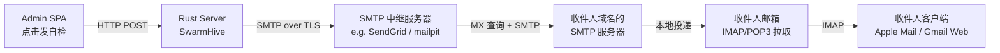

要点：

- **你的 Rust 服务并不是直接连到对方的邮箱**。中间隔了至少一个"SMTP 中继"（也叫 MTA，Mail Transfer Agent）。这个中继负责处理 DNS（MX 记录）、重试、退信、反垃圾排名（SPF / DKIM / DMARC 签名）等所有脏活。
- 你只需要做最左边那一段：用 SMTP 协议把邮件**交给**中继，剩下的事情中继操心。
- 这就是为什么生产环境必须挂一个真实的 SMTP provider（SendGrid、阿里云邮推、AWS SES、Postmark 等）。**你自己的家庭网络几乎不可能直接把邮件投到 Gmail** —— 因为 IP 不在白名单。

dev 环境用什么？答案是 **mailpit**：一个本地跑的"假"SMTP 服务器，所有发给它的邮件都进 Web UI（`:8025`），不会真的投递出去。零配置、零风险、零账号。

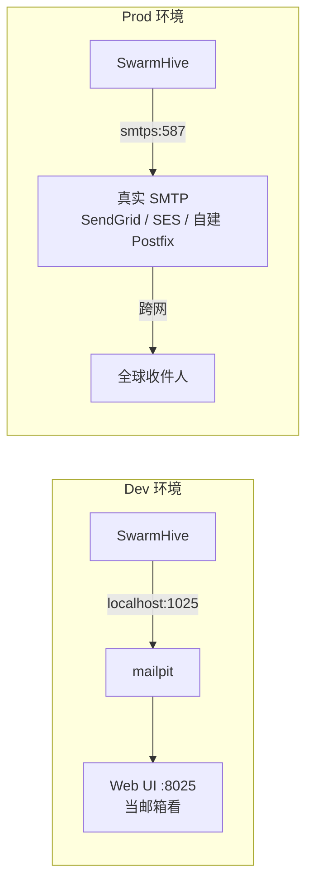

---

## 1. SMTP 协议速成（10 分钟看懂）

SMTP = **S**imple **M**ail **T**ransfer **P**rotocol，1982 年 RFC 821 定义，1996 年扩展成 ESMTP（RFC 5321）。它是一个**纯文本、基于 TCP 的命令-响应协议**。

最朴素的一次发送长这样：

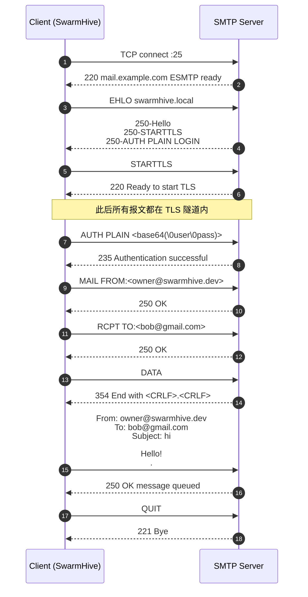

几个反直觉的点：

1. **端口三选一**：`25` 是服务器之间用的（家用宽带通常被运营商封）；`465` 是隐式 TLS（连上就是加密）；`587` 是提交端口（先明文连接，用 `STARTTLS` 升级到加密）。**应用对应该用 587 + STARTTLS**，这是 RFC 6409 的现代推荐。
2. **EHLO vs HELO**：HELO 是老版，EHLO 是扩展版（会让服务器返回它支持的扩展能力列表）。一律用 EHLO。
3. **认证方法**：`PLAIN` 把用户名 / 密码 base64 编码（**所以必须在 TLS 之内**！），`LOGIN` 是历史包袱，`CRAM-MD5` / `XOAUTH2` 是更现代的方案。`lettre` 默认会自动协商。
4. **邮件正文不在协议命令里**。`DATA` 之后到 `<CRLF>.<CRLF>` 之间是邮件正文，正文内部是 [RFC 5322 信封](https://www.rfc-editor.org/rfc/rfc5322.html)（`From:` / `To:` / `Subject:` 等 header + 空行 + body）。HTML 邮件、附件、多部分（multipart）都是在 5322 这一层用 MIME 表达。

> 🧠 记忆点：**SMTP 只管"怎么把字节送过去"，邮件长什么样是 RFC 5322 + MIME 的事**。

这正是 Rust 生态里 `lettre` 把 API 分成两层的原因：

- `lettre::message::Message` —— 构造一封符合 RFC 5322 + MIME 的邮件
- `lettre::transport::smtp::AsyncSmtpTransport` —— 把它通过 SMTP 送出去

---

## 2. Rust 生态：lettre + minijinja + aes-gcm

SwarmHive 的 `Cargo.toml` 邮件相关依赖只有三个：

```toml
[workspace.dependencies]
lettre       = { version = "0.11", features = ["tokio1-rustls-tls", "smtp-transport", "builder", "tracing"] }
minijinja    = "2"
aes-gcm      = "0.10"
```

各自分工：

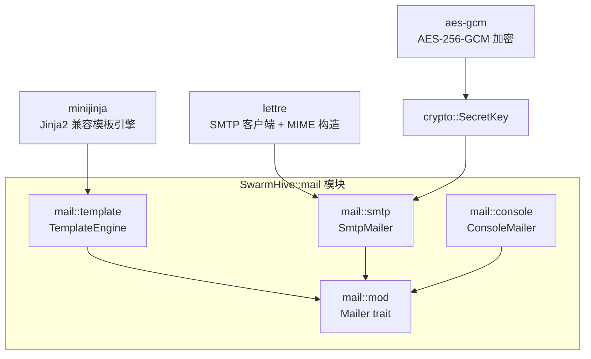

下面挨个聊。

### 2.1 `lettre`：Rust 里唯一靠谱的 SMTP 客户端

lettre 是 Rust 生态里事实上的标准 SMTP 客户端，由前 sendgrid 工程师维护，0.11 版本（2024）API 已稳定。三个核心类型：

| 类型 | 作用 | 来自模块 |
|---|---|---|
| `Message` | 一封完整邮件（header + body + MIME） | `lettre::message` |
| `Mailbox` | 单个收件人 / 发件人地址 + 可选 display name | `lettre::message::Mailbox` |
| `AsyncSmtpTransport` | 一个长连接 SMTP 传输（带连接池） | `lettre::transport::smtp` |

构造 transport 有三种姿势，对应 SMTP 的三种加密方式：

```rust
use lettre::transport::smtp::AsyncSmtpTransport;
use lettre::Tokio1Executor;

// 1. STARTTLS（587 端口，先明文后升级 TLS）—— 90% 的生产场景
let tx = AsyncSmtpTransport::<Tokio1Executor>::starttls_relay("smtp.sendgrid.net")?
    .port(587)
    .credentials(("apikey".into(), "SG.xxx".into()).into())
    .build();

// 2. 隐式 TLS（465 端口，连上就是加密）
let tx = AsyncSmtpTransport::<Tokio1Executor>::relay("smtp.example.com")?
    .port(465)
    .build();

// 3. 完全明文（dev only，比如 mailpit）
let tx = AsyncSmtpTransport::<Tokio1Executor>::builder_dangerous("localhost")
    .port(1025)
    .build();
```

第三种带个 `dangerous` 前缀提醒你 **prod 不要这么干**。我们在 SwarmHive 里把这三种映射成数据库枚举：

```rust
#[derive(EnumIter, DeriveActiveEnum)]
pub enum SmtpEncryption {
    StartTls,  // → starttls_relay
    Tls,       // → relay
    None,      // → builder_dangerous（仅 mailpit）
}
```

构造一封 multipart（同时带 HTML 和 plain text）邮件：

```rust
use lettre::message::{Message, MultiPart};

let message = Message::builder()
    .from("SwarmHive <noreply@swarmhive.dev>".parse()?)
    .to("bob@example.com".parse()?)
    .subject("欢迎加入 Acme Inc.")
    .multipart(MultiPart::alternative_plain_html(
        "纯文本版本，邮件客户端不支持 HTML 时显示".into(),
        "<h1>富文本版本</h1>".into(),
    ))?;

tx.send(message).await?;
```

`alternative_plain_html` 帮你生成 `Content-Type: multipart/alternative` 信封，客户端根据自己的渲染能力挑一个展示。这是写邮件的"两手准备"惯例 —— 永远同时提供 HTML 和 text 版本。

> ⚠️ **踩坑**：`"Name <email>".parse::<Mailbox>()` 在 display name 含特殊字符（括号、引号、逗号）时会被 lettre 的 RFC 5322 解析器拒掉。比如 `"SwarmHive (dev)"` 就过不去。解决方法是绕过 parse、直接构造：
>
> ```rust
> Mailbox::new(Some("SwarmHive (dev)".into()), addr.parse()?)
> ```
>
> `Mailbox::new` 把 quote 转义交给 encoder，encoder 知道何时该把 display name 加引号。这是 SwarmHive 的 [`parse_mailbox`](../../crates/swarmhive-server/src/mail/smtp.rs#L222) helper 存在的原因。

### 2.2 `minijinja`：Jinja2 兼容的 Rust 模板引擎

为什么不直接把 HTML 写死在 Rust 里？因为**部署者需要在线改邮件文案**：

- 公司换 logo / 改 brand color
- 邀请邮件的 CTA 链接结构调整
- 添加新语言 locale

把模板烤进 binary 意味着每改一句话都要重新 build + 重新部署。所以 SwarmHive 把模板存在 DB（`mail_template` 表）、运行时渲染。

minijinja 选型理由：

- API 简单（`Environment::new()` + `add_template` + `render`）
- 语法兼容 Python Jinja2，前端 / 后端运维都熟
- 单 crate 零依赖（不像 tera 会拉一堆 nom 依赖）
- 渲染错误信息友好（带行号 + 上下文）

最小可运行例子：

```rust
use minijinja::Environment;
use serde_json::json;

let mut env = Environment::new();
env.add_template("greeting", "Hello {{ name }}!")?;

let rendered = env.get_template("greeting")?
    .render(json!({ "name": "Alice" }))?;
// → "Hello Alice!"
```

SwarmHive 的 `TemplateEngine` 把这个流程包了一层缓存：

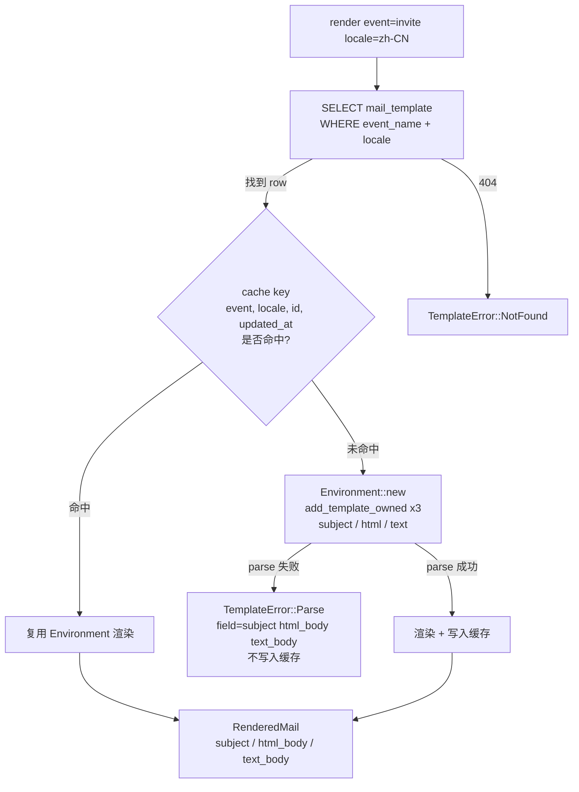

cache key 包含 `(event, locale, template_id, updated_at)`：

- **包含 updated_at** → Admin 改完模板按保存，下一次发送就用新内容，**无需重启进程**
- **包含 template_id (UUID v7)** → 如果某一毫秒内同时发生"删除 + 重建 + 第二次 updated_at 落到同毫秒"这种边角，UUID 不同也能让 key 不同
- **parse 失败不缓存** → 运维改坏了模板、修好再点保存就能立即恢复，不用解释"为什么我改回来了还是错"

代码骨架（节选自 [template.rs](../../crates/swarmhive-server/src/mail/template.rs#L60-L120)）：

```rust
type CacheKey = (String, String, uuid::Uuid, DateTime<Utc>);

pub struct TemplateEngine {
    cache: RwLock<HashMap<CacheKey, Cached>>,
}

impl TemplateEngine {
    pub fn render_row(&self, row: &mail_template::Model, ctx: &Value)
        -> Result<RenderedMail, TemplateError>
    {
        let key = (row.event_name.clone(), row.locale.clone(), row.id, row.updated_at);

        if let Some(cached) = self.cache.read().unwrap().get(&key) {
            return Self::render_with(cached, ctx);
        }

        let cached = Self::compile(row)?;             // parse 失败在这里短路返回
        let result = Self::render_with(&cached, ctx);
        self.cache.write().unwrap().insert(key, cached); // 仅成功 compile 才写入
        result
    }
}
```

注意 parse 错误用了一个 `field: &'static str`，标明是 subject / html_body / text_body 哪一段坏了 —— 这个细节会一路传到 Admin SPA 的 422 problem+json `extra.field`，UI 拿到后高亮对应编辑器 tab，运维一秒定位。

### 2.3 `aes-gcm`：为什么 SMTP 密码必须加密落盘

数据库里直接存明文密码是反模式：

- 备份 dump 一旦泄漏，所有外发邮件账号同时沦陷
- DBA / 运维 / 开发都能 `SELECT password FROM mail_provider` 看到
- 合规审计（SOC2 / ISO 27001）一票否决

但又不能 hash —— hash 是单向的，发邮件时需要明文密码塞给 SMTP 服务器 AUTH。所以**必须用对称加密 + 在内存里持有密钥**。

行业标准是 [AES-256-GCM](https://en.wikipedia.org/wiki/Galois/Counter_Mode)：

- AES-256：32 字节密钥，256-bit 块加密
- GCM：Galois / Counter Mode，同时提供机密性 + 完整性（authenticated encryption）—— 篡改密文会在解密时被检测到
- 每次加密用一个**全新随机 nonce**（96 bit），保证同样明文加密两次产生不同密文

SwarmHive 的 [`SecretKey`](../../crates/swarmhive-server/src/crypto.rs) 把这套包成两个方法：

```rust
pub struct SecretKey { cipher: Aes256Gcm }

impl SecretKey {
    pub fn encrypt(&self, plaintext: &str) -> Result<String, CryptoError> {
        // 1. 生成 12B 随机 nonce
        let mut nonce_bytes = [0u8; 12];
        OsRng.fill_bytes(&mut nonce_bytes);
        let nonce = Nonce::from_slice(&nonce_bytes);

        // 2. 加密 → 密文 + 16B 认证 tag
        let mut ciphertext = self.cipher.encrypt(nonce, plaintext.as_bytes())?;

        // 3. 自描述 blob：nonce || ciphertext || tag → base64
        let mut blob = Vec::with_capacity(12 + ciphertext.len());
        blob.extend_from_slice(&nonce_bytes);
        blob.append(&mut ciphertext);
        Ok(BASE64.encode(blob))
    }

    pub fn decrypt(&self, blob_b64: &str) -> Result<String, CryptoError> {
        let blob = BASE64.decode(blob_b64)?;
        let (nonce_bytes, ciphertext) = blob.split_at(12);
        let plain = self.cipher.decrypt(Nonce::from_slice(nonce_bytes), ciphertext)?;
        Ok(String::from_utf8(plain)?)
    }
}
```

可视化数据流：

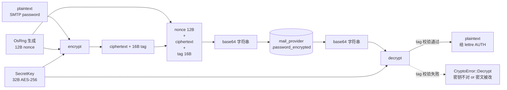

关键设计决策：

- **密钥来源**：`SWARMHIVE_SECRET_KEY` 环境变量（base64-32B）优先；缺则读 `config/local.toml` 的 `[secret] key`（这个文件在 `.gitignore` 里）。两者都缺 → server 启动 fail-fast，引导文案告诉运维用 `openssl rand -base64 32` 生成。
- **密钥不轮换**：丢了密钥等于丢了全部 SMTP 密码（必须重建 provider）。这是个有意识的简化 —— 给一个 32B key 配 KMS 轮换流程，对自托管单组织产品来说复杂度收益不成正比。运维只需把 SECRET_KEY 跟 DB 备份放在同一处即可。
- **同一把密钥多用途**：未来 OAuth `client_secret` 复用同一把 SecretKey，不为每个加密用途引入新 key。

---

## 3. SwarmHive 的设计：Mailer trait 抽象 + 双实现 + hot-swap

到这里你已经知道怎么用 lettre 发一封邮件。但生产代码里"发邮件"这个动作还要回答：

- 调用方不应该知道当前 active provider 是 SendGrid 还是 mailpit
- Server 启动时 SMTP 配置坏了 / 密钥错了 → 不能直接 crash，得有降级
- Admin 在 UI 改 provider 后要立即生效，不能要求重启
- 每一次发送都要留 audit trail（发了什么 / 给谁 / 成功还是失败 / 错误原因）

我们的答案：

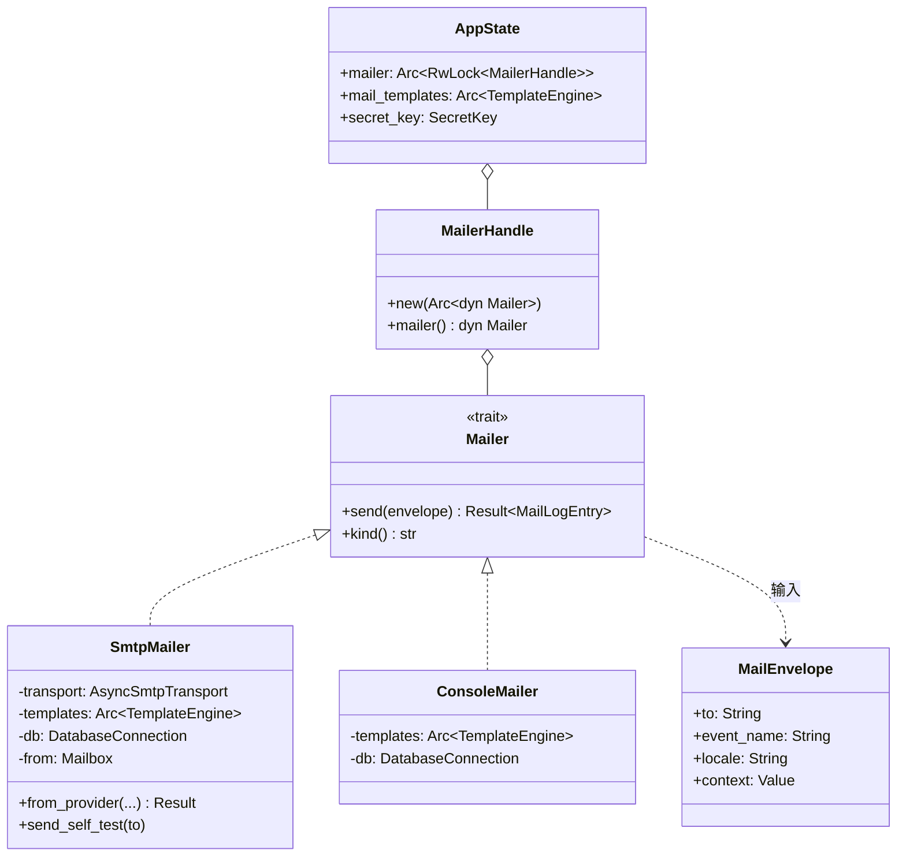

### 3.1 trait 定义

```rust
#[async_trait]
pub trait Mailer: Send + Sync + 'static {
    /// 渲染模板 → 通过底层 transport 投递 → 写一条 mail_log
    async fn send(&self, envelope: MailEnvelope) -> Result<MailLogEntry, MailError>;

    /// 区分器：用于 `/api/v1/mail/status` 驱动 SPA fallback banner
    fn kind(&self) -> &'static str;
}
```

`MailEnvelope` 是发送方递进来的描述：

```rust
pub struct MailEnvelope {
    pub to: String,           // 收件人 RFC 5322 地址
    pub event_name: String,   // "user_invite" / "password_reset" / ...
    pub locale: String,       // "en" / "zh-CN"
    pub context: Value,       // 渲染上下文（JSON）
}
```

调用方**不指定**用哪个 provider、不指定用哪份模板（template_id），而是说"我要给某人发一封 `user_invite` 类型的邮件，上下文是这些变量"。所有"用哪个 provider / 哪份模板 / 用什么加密"在 Mailer 实现内部解决。

### 3.2 两个实现

**SmtpMailer** —— 生产实现，依赖一个 `mail_provider` row：

```rust
pub fn from_provider(
    db: DatabaseConnection,
    templates: Arc<TemplateEngine>,
    provider: mail_provider::Model,
    secret_key: &SecretKey,
) -> Result<Self, SmtpInitError> {
    let from = parse_mailbox(&provider.from_email, provider.from_name.as_deref())?;
    let mut builder = match provider.encryption {
        SmtpEncryption::StartTls => AsyncSmtpTransport::starttls_relay(&provider.host)?,
        SmtpEncryption::Tls => AsyncSmtpTransport::relay(&provider.host)?,
        SmtpEncryption::None => AsyncSmtpTransport::builder_dangerous(&provider.host),
    }.port(provider.port as u16);

    if let (Some(user), Some(blob)) = (&provider.username, &provider.password_encrypted) {
        let password = secret_key.decrypt(blob)?;
        builder = builder.credentials(Credentials::new(user.clone(), password));
    }
    Ok(Self { transport: builder.build(), /* ... */ })
}
```

注意构造函数返回 `Result`：解密失败 / hostname 不可解析 / TLS 握手失败 都会返回 `SmtpInitError`，**不会** panic。这是降级的前提。

**ConsoleMailer** —— dev / fallback 实现：

```rust
impl Mailer for ConsoleMailer {
    async fn send(&self, envelope: MailEnvelope) -> Result<MailLogEntry, MailError> {
        let rendered = self.templates.render(&self.db, &envelope.event_name, ...).await?;
        println!("[ConsoleMailer] → {}\n  subject: {}\n  text:\n{}\n",
                 envelope.to, rendered.subject, rendered.text_body);
        // 还是写 mail_log，但 provider_id = NULL
        // ...
    }
    fn kind(&self) -> &'static str { "console" }
}
```

ConsoleMailer 的工作只是**渲染 + 打 stdout + 写日志**，永远成功。它的存在确保 "调用 `mailer.send()` 永远不会因为 SMTP 没配好而 panic" —— 这样后续的邀请 / 密码重置流程不用每个地方写 fallback 分支。

### 3.3 Hot-swap：`Arc<RwLock<MailerHandle>>`

AppState 里持有的不是 `Mailer`，而是一个**可热替换的槽位**：

```rust
pub type MailerSlot = Arc<RwLock<MailerHandle>>;

pub struct AppState {
    pub mailer: MailerSlot,
    // ...
}

#[derive(Clone)]
pub struct MailerHandle(Arc<dyn Mailer>);
```

启动期默认装 ConsoleMailer；接着 `wire_active_mailer()` 查 DB：

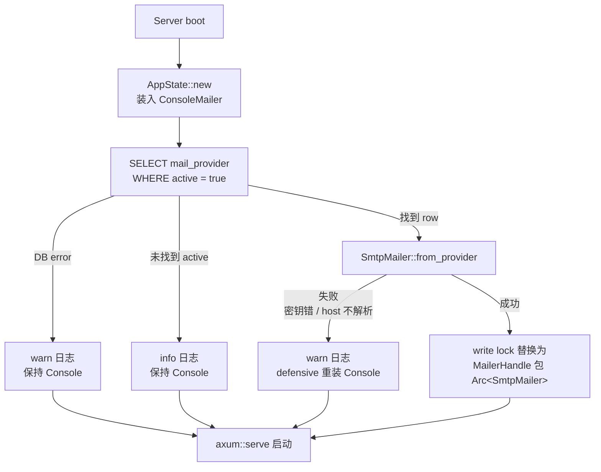

代码（[bin/server.rs](../../crates/swarmhive-server/src/bin/server.rs#L85-L118)）：

```rust
async fn wire_active_mailer(state: &AppState, db: &DatabaseConnection, secret_key: &SecretKey) {
    let Some(row) = mail_provider::Entity::find()
        .filter(mail_provider::Column::Active.eq(true))
        .one(db)
        .await
        .ok()
        .flatten()
    else {
        info!("no active mail provider; ConsoleMailer fallback in effect");
        return;
    };

    match SmtpMailer::from_provider(db.clone(), state.mail_templates.clone(), row, secret_key) {
        Ok(smtp) => {
            *state.mailer.write().expect("mailer slot poisoned")
                = MailerHandle::new(Arc::new(smtp));
            info!("smtp mailer wired");
        }
        Err(err) => warn!(?err, "failed to build SmtpMailer; staying on ConsoleMailer"),
    }
}
```

运行时 swap：Admin 在 UI 点了"激活某 provider"或"删除当前 active" → handler 调 `refresh_mailer(&state)` → 重新查 active row 重建 SmtpMailer 写入 slot。**调用方仍然只是 `state.mailer.read().mailer().send(...)`，对 swap 完全无感**。

`RwLock` 的选择：读远多于写（每次发邮件读一次，激活 / 删除是低频写操作），所以 `RwLock` 比 `Mutex` 更合适。`Arc` 让 handle 可以从多线程并发 read。

---

## 4. 端到端：发出一封邀请邮件

把上面所有东西拼起来，看一次完整的发送流程：

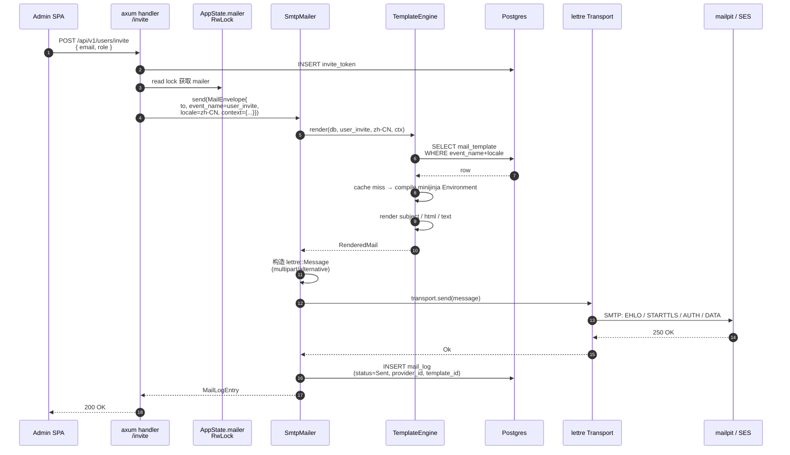

任何一步失败都会：

1. SmtpMailer 把错误捕获、写 `mail_log status=Failed` + error 字符串
2. 把 `MailError` 上传给 handler
3. handler 决定怎么响应客户端（邀请通常会 200，因为 token 已经创建；邮件失败用户可以重发）

这种"**失败也写日志**"的模式让运维在 Admin SPA 的 Mail Logs 页面能直接看到"3 分钟前给 bob@gmail.com 发邀请失败，错误 = TLS handshake timeout"，不必去翻 server stdout。

---

## 5. 数据模型：三张表的分工

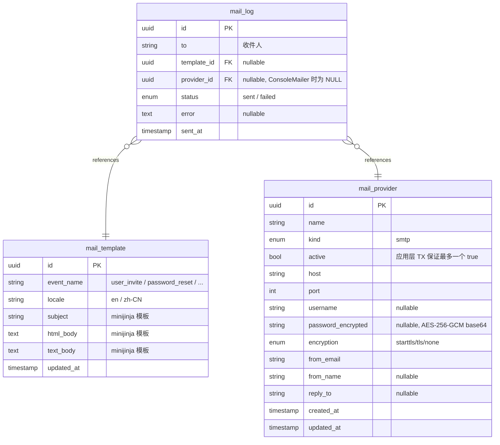

设计原则：

1. **Provider 表只有一行 active**：靠应用层 TX 维护（`POST /providers/:id/activate` 先把其他行置 false 再开自身），不用 partial unique index —— 后者会触发 sea-orm 2.0-rc.38 `schema-sync` 的 `pg_indexes` ↔ `pg_constraint` 混淆 bug。Postgres READ COMMITTED + 行锁串行化并发 activate 已经够用。
2. **Template 表用 `(event_name, locale)` 复合唯一**：sea-orm 2 的 `#[sea_orm(unique_key = "event_locale")]` 语法表达，schema-sync 友好。
3. **Log 表只持久化 metadata，不存 body**：邮件体可能很大（带 HTML + 内嵌图），存全文会让 audit 表膨胀失控。要 debug 看具体内容时，去 mailpit 或 prod SMTP provider 的 dashboard 看。
4. **template_id / provider_id 都允许 NULL**：ConsoleMailer 发的日志 provider_id 为 NULL；如果模板被删了 template_id 也为 NULL —— 保证历史日志不会因为后续配置变化而坏掉。

---

## 6. 一些经验性的踩坑总结

按"会让生产环境出问题的严重程度"排序：

### 6.1 端口 + 加密的对应关系不要搞错

| 端口 | 加密 | 用途 |
|---|---|---|
| 25 | 无 / opportunistic TLS | 服务器之间中继；家用 / 云上常被封 |
| 465 | **隐式 TLS** | submissions，连上立即加密握手 |
| 587 | **STARTTLS** | submission，明文连接后用 STARTTLS 升级 |
| 2525 | STARTTLS | 部分 provider 给端口封死场景的兜底 |
| 1025 | 无 | dev / mailpit 默认 |

最常见的错误：选了 `port: 587` 但 `encryption: Tls`（隐式 TLS），结果握手立即超时 —— 因为服务器 587 端口在等明文 EHLO，你直接给它发了 TLS ClientHello。

### 6.2 反垃圾：SPF / DKIM / DMARC

DNS 这一层的事情，但跟应用强相关：

- **SPF**：在 your-domain.com 的 TXT 记录里声明"以下 IP 可以代表我发邮件"。SendGrid / SES 都会给你具体的 `include:` 字符串。
- **DKIM**：用私钥签名邮件 header，公钥放 DNS。Gmail / Outlook 看到签名 + DNS 公钥能验证 → 邮件不进垃圾箱。SendGrid 这种 SaaS provider 替你做。
- **DMARC**：基于 SPF + DKIM 的策略声明，告诉对方"如果 SPF/DKIM 都没通过，请把我的邮件拒掉 / 隔离 / 报告给我"。

新搭一个邮件服务，**SPF / DKIM 不配置约等于邮件进不去 Gmail 收件箱**。这是 lettre 帮不了你的事，必须在 DNS 那一层做。

### 6.3 Display name 里的特殊字符

前面提过，`"SwarmHive (dev) <addr>".parse()` 会被 lettre 拒。括号、引号、逗号、`@` 在 RFC 5322 里是 special token，要么用 `\` 转义、要么用引号包，要么——更靠谱——直接 `Mailbox::new` 把 raw display 字符串递给 encoder。

### 6.4 Multipart 顺序：text 在前，HTML 在后

```rust
MultiPart::alternative_plain_html(text_body, html_body)
```

不是反过来。RFC 2046 §5.1.4 规定：multipart/alternative 中，**越靠后的 part 对客户端"越优先"**。所以希望 HTML 客户端优先渲染 HTML，就把 HTML 放后面。lettre 的 `alternative_plain_html` 参数顺序已经替你想好。

### 6.5 邮件不要在 web 请求线程里发

虽然 lettre 是 async 的、不会真的 block 线程，但 SMTP 握手 + DATA 上传 + 250 OK 等待 在一个差的网络下可能要 10+ 秒。把这种延迟绑在 HTTP 请求里，前端体验会很差。

**生产做法**：HTTP handler 把发邮件任务塞到一个队列（Redis / Postgres LISTEN / NOTIFY / 单纯的 tokio channel），后台 worker 异步消费。SwarmHive 当前版本还是同步发的 —— 因为 mail volume 极低（邀请 / 重置都是用户主动触发，每天 < 100 封），加 worker 抽象不划算。等业务量起来再加。

### 6.6 ConsoleMailer 不是玩具

它在 prod 也有用：

- 邮件配置还没设置（首次部署）→ Admin 第一次打开后台看不到 banner 提示 "邮件未配置"
- 现有 provider 被改坏 → server 不至于完全 down，运维有时间在 UI 改回来
- 集成测试 → 不依赖外部 SMTP

所以 ConsoleMailer 不是"开发用的假货"，而是**生产降级路径**。它的 `mail_log` 写入告诉运维"这封邮件没真的发出去，只是打到 server stdout 了"，避免被忽略。

---

## 7. 总结：Rust 的优势在哪？

走完这一圈，回头看 Rust 实现邮件服务相比 Python / Node 的好处：

| 维度 | Rust + lettre | Python smtplib | Node nodemailer |
|---|---|---|---|
| 类型安全 | `Message` 编译期保证 RFC 5322 结构 | 拼字符串 | 对象但运行时校验 |
| 异步 | `AsyncSmtpTransport` + tokio 一体 | 标准库同步；要 async 需用 aiosmtplib | 原生 Promise |
| TLS | rustls 静态链接，无 OpenSSL 烦恼 | 系统 ssl 库 | 节点 tls |
| trait 抽象 | 编译期单态化，零运行时开销 | duck typing | duck typing |
| 二进制部署 | 单 binary（含 templates 之外的一切） | 拖 venv | 拖 node_modules |
| 内存安全 | 没有 use-after-free 风险 | GC 但有 C 扩展隐患 | GC |

**最大的实践收益不是性能，是 trait + 强类型 + Send/Sync 共同保证的"重构无后顾之忧"**。把 SmtpMailer 换成 SesMailer / SendGridApiMailer 只需要在 trait 后面挂一个新实现 + bin/server.rs 改一个分支，编译器会检查所有调用点。

最大的痛苦：lettre 0.11 还在打磨期，docs 没那么齐；遇到 RFC 5322 边角（多语言 display name、超长 header、附件 content-id）经常要去翻它的 issue tracker。但比起 Python 那种"一切都是字符串拼接，错了运行时再爆"的体验，已经好太多。

---

## 8. 业务场景：Mail 基础设施能用来做什么

到这里你应该明白"我们写了一套 Mailer trait + 模板引擎 + 加密 + 日志"。但**这套东西到底解决什么业务问题**？SwarmHive 是个更新分发平台，邮件不只是用来重置密码 —— 实际上它支撑着两类完全不同的业务场景。

### 8.1 事件触发：CI/CD 上传应用后通知订阅者

最直接的延伸：开发者通过 GitHub Action 跑 `swarmhive publish v1.2.3` 把新版本推到 hub，**自动给所有订阅该 app 的用户发邮件**。这是邀请 / 密码重置之外最有商业价值的场景。

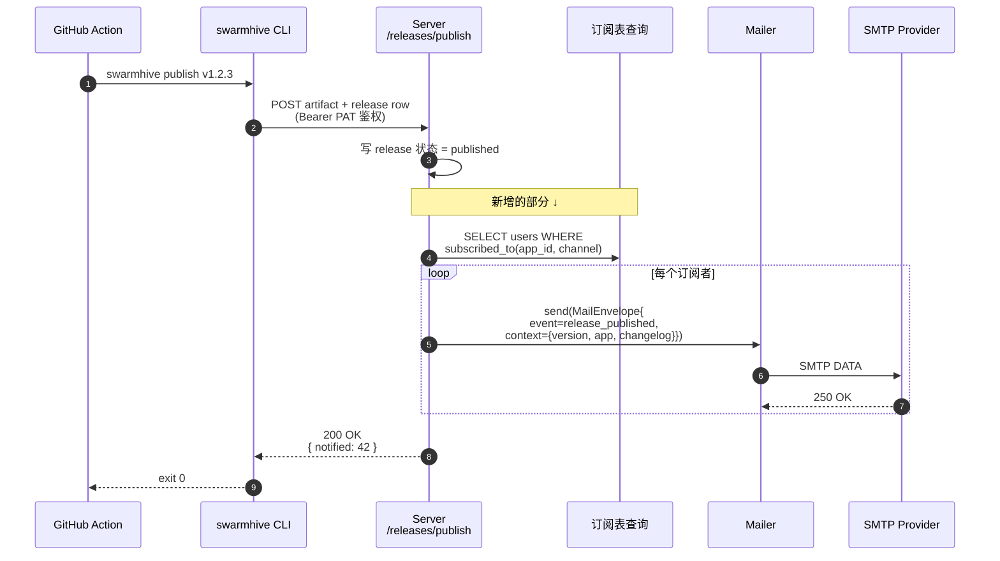

**Mail 基础设施侧零改动** —— `Mailer::send` 的 envelope 抽象正是为这个准备的。需要新增的全在业务侧：

1. **订阅关系表** `release_watcher(user_id, app_id, channel)`：谁要收哪个 app 哪个 channel 的通知。Owner / Admin 默认订阅所有 release，普通 user 在 Profile 页选择性订阅。
2. **`release_published` 模板**：把当前 4 个默认模板（`user_invite` / `password_reset` / `email_verify` / `security_alert`）扩成 5 个。一行 INSERT + 一份 jinja2，运维 UI 可改。
3. **发布完成的 hook**：在 `routes/releases.rs::publish` handler 写 release 后追加订阅者查询 + 循环 send。

未来 `add-release-notifications` proposal 会承接这块 —— mail 基础设施已经备好，只缺业务侧的订阅模型 + hook 接入点。

> 💡 类似套路还能做：**新 app 创建告知所有 admin**、**artifact 上传成功回执给上传者**、**版本被 rollback 时通知所有曾下载该版本的客户端**。全部走同一个 `Mailer::send(MailEnvelope{event_name, context})` 模式，只需要新增 template + hook。

### 8.2 定时触发：每日下载摘要 / 周报

第二类场景是**定时聚合后发送**，比如：

- 每天 09:00 给 app owner 发昨日下载量摘要
- 每周给所有 admin 发用户活跃度周报
- 每月给 billing 联系人发存储 / 带宽用量报表

这类场景 Mail 基础设施仍然不用动，但要补一个**调度器**组件。

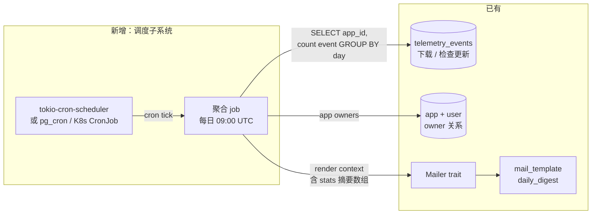

调度器三种选型：

| 方案 | 优势 | 劣势 |
|---|---|---|
| `tokio-cron-scheduler` 嵌入进程 | 零外部依赖；同进程同 DB 连接；最快上手 | server down 期间 job 漏跑；多实例会重复触发 |
| Postgres `pg_cron` 扩展 | 集中调度，多 server 实例只跑一次；和 DB 事务一体 | 需要 RDS / 自建 PG 装扩展（不是所有云都支持） |
| 外部 cron / K8s CronJob 调 `curl /api/v1/admin/jobs/daily-digest` | 部署灵活；和 server 解耦 | 多一个调度系统要维护；要给 admin job 单独留鉴权口子 |

SwarmHive 当前是单 server 部署 → **第一种最简单**。等需要 HA 时迁到 `pg_cron` 是直接换 trait 的事。

### 8.3 更多业务场景的可能

把上面两类模式推广一下，邮件基础设施还能承接：

| 场景类型 | 触发方式 | 例子 |
|---|---|---|
| **配额告警** | 事件 + 阈值 | 存储用量 > 80%、API 调用数 > plan limit |
| **安全告警** | 事件即发 | 异常登录地点、PAT 创建 / 删除、Owner 权限变更 |
| **CI 失败回执** | 事件即发 | GitHub Action 调 `publish` 失败 → 邮件告知 release 没发出去 |
| **客户端崩溃报告摘要** | 定时聚合 | 每天给 app owner 发该 app 24h 内崩溃 top 10 |
| **付费提醒** | 定时单次 | 订阅到期前 7 天、信用卡过期提醒 |
| **digest 摘要** | 定时聚合 | 每周给 owner 一封"本周 5 个新版本、12 次 rollback、3 个新 user"摘要 |

**全部走同一套 `Mailer::send(MailEnvelope{event, locale, context})`**。新增一个场景的工作量基本上是：

1. 加一行 `mail_template` seed（subject + html + text）
2. 写一段 jinja2 模板（涉及哪些 context 变量）
3. 在业务 handler 或 cron job 里调一行 `state.mailer.read().mailer().send(envelope).await`

`Mailer trait` 把所有"发邮件"统一成同一个调用点，是这种业务可扩展性的关键。

### 8.4 邮件量上来后必须想清楚的 5 件事

业务跑起来后，邮件量会从"每天几封测试"变成"每天上万封 release 通知 + 用户摘要"。这时候五个之前可以装鸵鸟的问题会同时浮出水面：

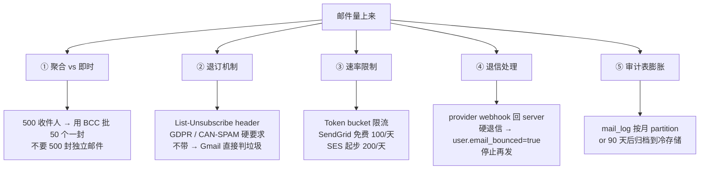

#### 1. 聚合 vs 即时

一个 release 发布触发 500 封通知，该怎么发？

- **方案 A：500 封独立邮件** → 500 次 SMTP DATA，每次握手 ~200ms，10 秒 + provider 容易认为是垃圾邮件 burst → 拉黑
- **方案 B：1 封 BCC 500 人** → 1 次 DATA，但暴露收件人列表（隐私问题）+ 部分 provider 限制单封 BCC 数量（SES 默认 50）
- **推荐方案 C：按 50 个 BCC 一批，10 封邮件，每封间隔 1 秒** → 平衡延迟、隐私、限流

实现上需要在 Mailer 之上加一个 `BulkMailer`（不是 trait 新方法，是封装层），负责把一个"逻辑通知"展开成多个 SMTP 请求并节流。

#### 2. 退订机制

每封邮件必须带 `List-Unsubscribe` header，例如：

```text
List-Unsubscribe: <https://swarmhive.dev/u/abc123>, <mailto:unsubscribe@swarmhive.dev?subject=abc123>
List-Unsubscribe-Post: List-Unsubscribe=One-Click
```

不带的话 **Gmail 直接进垃圾箱**，2024 年新规更严格（高频发送者必须 One-Click Unsubscribe）。lettre `Message::builder().header(...)` 直接加一行的事，但要在 Mailer 上层为每个用户生成 token。

#### 3. 速率限制

各家 provider 的免费 / 起步配额：

| Provider | 免费 / 起步 | 付费阶 |
|---|---|---|
| SendGrid | 100 封/天 | 100k 封/月起 $19.95 |
| AWS SES | 200 封/天 沙箱 | $0.10 / 1k 封（出沙箱后无上限） |
| Postmark | 100 封/月 试用 | $15/月 起 10k 封 |
| 阿里云邮推 | 200 封/天 免费 | ¥1 / 1k 封 |

应用层要做一个 **token bucket**：超量时把 envelope 推到死信队列（DLQ），第二天慢慢消化。最简单的实现就是一张 `mail_queue` 表 + 一个后台 tokio task 定时 SELECT FOR UPDATE SKIP LOCKED 消费。

#### 4. 退信处理（bounces）

退信分两类：

- **软退信**（mailbox full、temporary defer）→ provider 自动重试，不用管
- **硬退信**（mailbox does not exist、domain not found）→ **必须**标记 `user.email_bounced = true`，停止再发，否则 IP 信誉评分会持续下降，最终被全网 provider 拉黑

捕获方式：

- **SES** → 配置 SNS topic → server 暴露一个 `/api/v1/webhooks/ses-bounce` 接 SNS HTTPS subscription
- **SendGrid** → 配 Event Webhook → 同样的 server endpoint 接收 JSON 数组
- **自建 SMTP** → 解析 RFC 3464 DSN 报文，复杂得多

#### 5. 审计表膨胀

`mail_log` 每发一封写一行，每天 1 万封 → 一年 365 万行。三种应对：

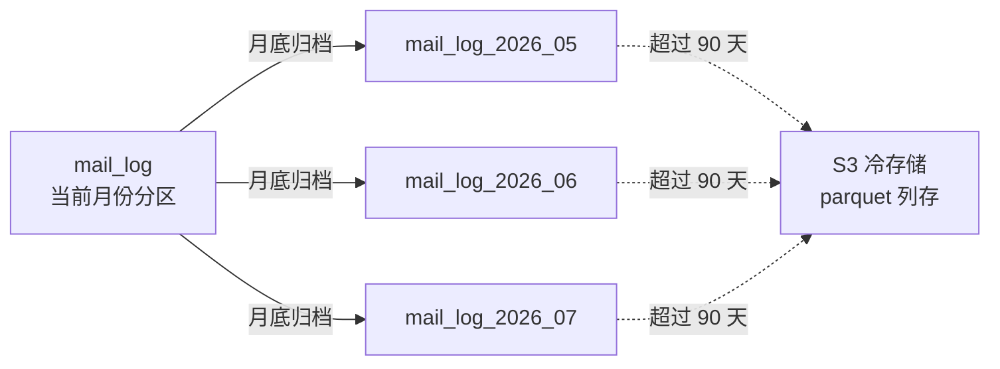

- **方案 A：按月 partition**（PostgreSQL 原生 `PARTITION BY RANGE (sent_at)`），DROP 老 partition 比 DELETE 快几个量级
- **方案 B：归档到 S3**，老数据导成 Parquet，查询走 DuckDB
- **方案 C：保留 90 天 hot + 1 年 warm + 永久删除**，足够大部分支持 + 审计场景

SwarmHive 当前一个月几百封发送，远未到需要 partition 的量级 —— **等到月增长 > 10 万再考虑**，提前优化是技术债。

---

## 9. 延伸阅读

- [RFC 5321 — Simple Mail Transfer Protocol](https://www.rfc-editor.org/rfc/rfc5321) 协议本身，70 页，比想象中读得快
- [RFC 5322 — Internet Message Format](https://www.rfc-editor.org/rfc/rfc5322) 邮件 header / body 格式
- [RFC 6409 — Message Submission for Mail](https://www.rfc-editor.org/rfc/rfc6409) 为什么用 587 不用 25
- [lettre 官方 docs](https://docs.rs/lettre) 0.11 API
- [minijinja docs](https://docs.rs/minijinja) 模板引擎
- [RustCrypto/AEADs aes-gcm](https://github.com/RustCrypto/AEADs) AES-GCM 实现及其安全考量
- SwarmHive 实现源码：
  - [crates/swarmhive-server/src/mail/](../../crates/swarmhive-server/src/mail/) — mod / smtp / console / template / seed
  - [crates/swarmhive-server/src/crypto.rs](../../crates/swarmhive-server/src/crypto.rs) — SecretKey
  - [crates/swarmhive-server/src/routes/mail.rs](../../crates/swarmhive-server/src/routes/mail.rs) — 12 个 HTTP endpoint

下一篇会写"SwarmHive 是如何把邀请 / 密码重置这类'需要邮件的业务流程'套在这个 Mail 基础设施上的" —— 等 [add-invite-and-password-reset](../../openspec/changes/add-invite-and-password-reset/) proposal apply 完了再写。
