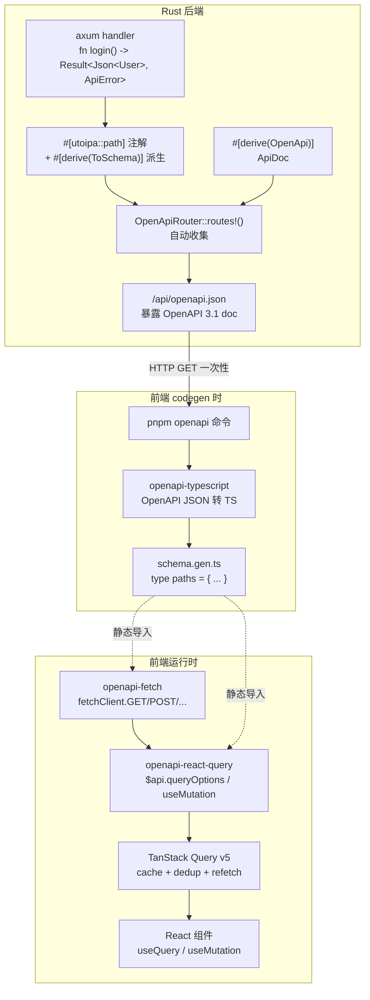
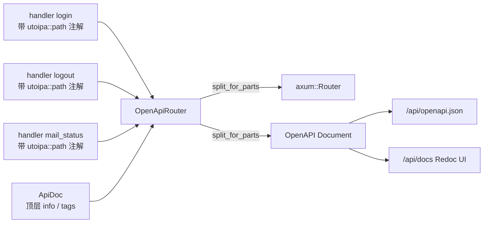
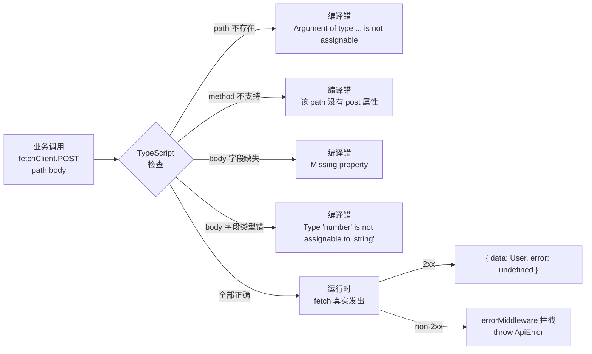
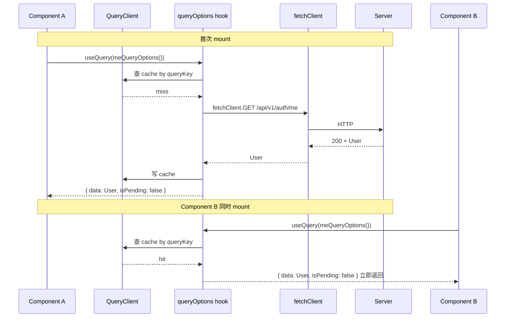
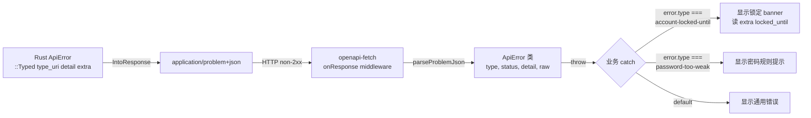
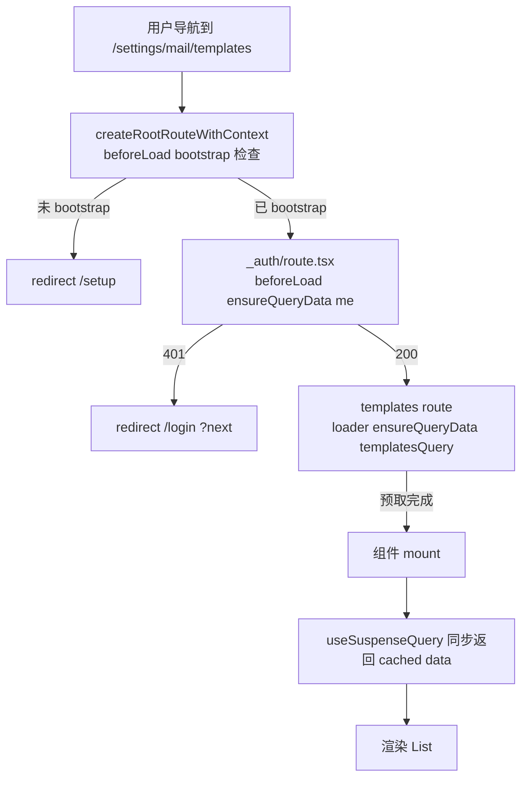

# Rust 后端到 React 前端的端到端类型安全 —— utoipa + openapi-fetch + TanStack Query 全链路

> 写在前面：上一篇讲了 [Rust 怎么写邮件服务](2026-05-27-rust-mail-service-deep-dive.md)，是"单端深入"。这一篇换个维度，讲**跨端**：一个 Rust 写的 API endpoint 怎么不写一行手工胶水就能在 React 前端被 typed 地调用、被 TanStack Query 自动缓存、错误被自动分类、IDE 自动补全到 response 的某个字段。
>
> 完整技术栈：
>
> | 层 | 技术 |
> |---|---|
> | Rust 注解 | `utoipa` + `utoipa_axum` |
> | OpenAPI 文档 | OpenAPI 3.1 JSON + Redoc UI |
> | Codegen | `openapi-typescript` |
> | HTTP 客户端 | `openapi-fetch` |
> | 数据层 | `openapi-react-query` 包装 TanStack Query v5 |
> | 路由层 | TanStack Router 1.x（loader + beforeLoad）|
> | 错误协议 | RFC 9457 `application/problem+json` |
>
> 这套组合在 React 生态里属于"端到端类型安全"最前沿的方案之一。我会按"问题 → 原理 → 6 层逐进 → 实战 → 踩坑"展开，假设读者熟悉 React / TypeScript 基础，但完全没用过 utoipa 或 OpenAPI codegen。

---

## 0. 痛点：手写 API 客户端的六个坑

先回答"为什么要折腾这套"。如果你的项目还是这样写前端：

```typescript
// 手写 fetch wrapper
async function getMe(): Promise<MeResponse> {
  const r = await fetch("/api/v1/auth/me");
  if (!r.ok) throw new Error("fail");
  return r.json();
}

// 手写 DTO
interface MeResponse {
  user: { id: string; email: string; display_name: string };
  permissions: string[];
}
```

你会持续踩这六个坑：

1. **DTO 漂移**：后端把 `display_name` 改成 `displayName` → 前端运行时才爆
2. **必填可选反了**：后端这个字段是 `Option<String>` 还是 `String`？前端没法知道 → 处处 `?.`
3. **路径串错**：`/api/v1/auth/me` 拼成 `/api/v1/auth/my` → 测试时 404
4. **方法填错**：POST 写成 GET → server 405
5. **错误码不对齐**：后端返 422 / 409 / 410 各有语义，前端 catch 都用 `if (err.message.includes("expired"))` 字符串匹配
6. **多版本并存**：v1 / v2 endpoint 同时跑时，靠 IDE 找到所有用 v1 的地方手工迁移 → 漏掉

每一个 bug 都在**运行时**才发现，而且大多需要后端 / 前端两边都改。

**这套技术栈的核心承诺**：所有六个坑都在**编译时**爆，IDE 给红线，CI 在合并前挡掉。

---

## 1. 总览：六个组件怎么协作



阅读顺序：**Rust 注解 → 启动期收集 → 一次 codegen → 静态导入 → 运行时强类型调用**。任何环节出问题，编译期都会爆。

---

## 2. Rust 侧第一步：utoipa 把 Rust 类型暴露成 OpenAPI

[utoipa](https://github.com/juhaku/utoipa) 是 Rust 生态主流的 OpenAPI 生成库（>3k star，活跃维护）。它通过**派生宏 + 路径宏**把 Rust 的强类型信息编译期收集成 OpenAPI 3.1 文档。

### 2.1 `#[derive(OpenApi)]` 顶层文档

整份 OpenAPI 文档的元信息（title、tags、安全方案）由一个空结构体 + `#[derive(OpenApi)]` 表达：

```rust
// crates/swarmhive-server/src/openapi.rs
use utoipa::OpenApi;

#[derive(OpenApi)]
#[openapi(
    info(
        title = "SwarmHive API",
        description = "Self-hosted update distribution hub.",
        license(name = "Apache-2.0"),
    ),
    // 不被任何 handler 直接引用、但需要出现在 components.schemas 的 schema
    // 必须在这里手动列出。最典型的就是 Problem（被错误响应 $ref，但 IntoResponses
    // 不会把它拉进 components.schemas）。
    components(schemas(crate::error::Problem)),
    tags(
        (name = "health",  description = "Liveness probe."),
        (name = "auth",    description = "Login / logout / me / cli-token."),
        (name = "mail",    description = "SMTP provider config + templates + logs."),
        // ...
    ),
)]
pub struct ApiDoc;
```

注意 `ApiDoc` 是个 **zero-sized** 类型（没有字段），只是承载元信息的载体。`ApiDoc::openapi()` 在编译期生成一个 `utoipa::openapi::OpenApi` 结构。

### 2.2 `#[utoipa::path]` 端点注解

每个 axum handler 头上加一个 `#[utoipa::path]`：

```rust
#[utoipa::path(
    post, path = "/api/v1/auth/login",
    request_body = LoginReq,
    responses(
        (status = 200, body = api::User, description = "Authenticated. Session cookie set."),
        ApiErrorResponses,
    ),
    tag = "auth",
)]
async fn login(
    State(state): State<AppState>,
    session: Session,
    GardeJson(req): GardeJson<LoginReq>,
) -> Result<Json<api::User>, ApiError> {
    // ...
}
```

宏展开后，注入了一段静态注册函数，运行时会被 utoipa-axum 收集。注意三件事：

- `request_body = LoginReq` 引用的是 Rust 类型，**编译器会验证 LoginReq 实现了 `ToSchema`**，签名不一致编译不过
- `body = api::User` 同理
- `ApiErrorResponses` 是**一次性铺开整个错误矩阵**的捷径（下一节细说）

### 2.3 `ToSchema` 派生：让 DTO 自动 OpenAPI 化

Request / Response 用到的所有结构体加 `#[derive(ToSchema)]`：

```rust
#[derive(Debug, Deserialize, Validate, ToSchema)]
pub struct LoginReq {
    #[garde(email)]
    pub email: String,

    /// Min 10 chars per `add-auth-and-rbac` proposal. doc 注释会被
    /// utoipa 提取为 OpenAPI 的 `description`。
    #[garde(length(min = 10))]
    pub password: String,
}
```

派生宏读取：

- **字段类型** → 翻译成 OpenAPI 的 `type: string` / `type: integer` / `format: uuid` 等
- **Option<`T`>** → `nullable: true` 或者从 `required` 列表去掉
- **doc 注释** `///` → OpenAPI 的 `description`
- **serde 属性** `#[serde(rename = "snake_case")]` → 自动反映到 schema property name

`Validate` 是 garde 验证宏，跟 utoipa 正交（utoipa 也能读 `#[schema(...)]` 提取 example / min / max，但项目里规则交给 garde 跑运行时校验，utoipa 只管对外文档）。

### 2.4 `IntoResponses`：一次声明，所有错误自动文档化（关键技巧）

最容易遗漏的细节：**错误响应也是 API 的一部分**，必须文档化。如果每个 handler 都手写 `(status = 401, ...)`, `(status = 403, ...)`, `(status = 422, ...)` 一长串，会爆炸。

SwarmHive 的做法 —— 把所有错误响应收口到一个 `IntoResponses` 派生类型：

```rust
#[derive(IntoResponses)]
#[allow(dead_code)]  // 仅为 OpenAPI 生成存在
pub enum ApiErrorResponses {
    #[response(status = 401, description = "Authentication required.")]
    Unauthorized(#[ref_response = "Problem"]),

    #[response(status = 403, description = "Missing permission.")]
    Forbidden(#[ref_response = "Problem"]),

    #[response(status = 404, description = "Resource not found.")]
    NotFound(#[ref_response = "Problem"]),

    #[response(status = 409, description = "Conflict with current state.")]
    Conflict(#[ref_response = "Problem"]),

    #[response(status = 410, description = "Resource is gone.")]
    Gone(#[ref_response = "Problem"]),

    #[response(status = 422, description = "Validation failed.")]
    Validation(#[ref_response = "Problem"]),

    #[response(status = 500, description = "Internal server error.")]
    Internal(#[ref_response = "Problem"]),
}
```

handler 只需引用一次：

```rust
#[utoipa::path(
    post, path = "/api/v1/auth/login",
    responses(
        (status = 200, body = api::User),
        ApiErrorResponses,            // ← 这一行展开成 7 个错误响应
    ),
)]
```

效果：每个 handler 在 OpenAPI 文档里都自动带 7 个状态码的响应定义，前端 codegen 出的 TypeScript 类型每个 endpoint 都有所有可能的错误。

> 💡 这是"集中定义 + 散点引用"模式：错误集中归口，节省 100+ 行重复注解，新增错误状态码时只改一处。

### 2.5 `utoipa-axum`：让注解自动注册到 axum router

光有 `#[utoipa::path]` 注解还不够 —— 需要把它和实际 axum `Router` 关联起来。`utoipa-axum` 就是那座桥：

```rust
use utoipa_axum::router::OpenApiRouter;
use utoipa_axum::routes;

pub fn router() -> OpenApiRouter<AppState> {
    OpenApiRouter::new()
        .routes(routes!(login))          // ← 宏展开成 .route(...) + 记录 OpenAPI path
        .routes(routes!(logout))
        .routes(routes!(me))
        .routes(routes!(cli_token))
}
```

`OpenApiRouter` 是 `axum::Router` 的薄包装，每个 `.routes(routes!(handler))` 调用同时：

1. 像普通 axum 一样把 handler 挂到对应路径
2. 从 handler 头上的 `#[utoipa::path]` 注解读 method + path + body + responses
3. 把这些信息累加到一个内部 OpenAPI 文档

最后在 `build_router` 里 `split_for_parts()` 把组装好的 router 和 OpenAPI doc 分开：

```rust
let api_router: OpenApiRouter<AppState> = OpenApiRouter::with_openapi(ApiDoc::openapi())
    .merge(routes::auth::router())
    .merge(routes::mail::router())
    // ...
    ;

let (axum_router, openapi) = api_router.with_state(state).split_for_parts();

axum_router
    .route("/api/openapi.json", get(move || async move { Json(openapi.clone()) }))
    .merge(Redoc::with_url("/api/docs", openapi))
```

**两个公开端点**：

- `/api/openapi.json` —— 给 codegen 工具消费的机读文档
- `/api/docs` —— Redoc 渲染的可交互人读文档

服务器跑起来后访问 `http://localhost:3030/api/docs` 就能看到完整的 API 文档，每个 endpoint 含 request body schema、所有 response 状态码、可点击展开的字段说明。



---

## 3. CodeGen：openapi-typescript 把 JSON 翻成 TS 类型

后端跑起来后，前端只需要一条命令拉取 `openapi.json` 转成 TS：

```bash
# apps/admin/package.json scripts
"openapi": "openapi-typescript http://localhost:3030/api/openapi.json -o src/lib/api/schema.gen.ts"
```

输出的 [schema.gen.ts](apps/admin/src/lib/api/schema.gen.ts) 是一个**单文件**，导出两个核心类型：

```typescript
export interface paths {
  "/api/v1/auth/login": {
    post: {
      requestBody?: {
        content: {
          "application/json": components["schemas"]["LoginReq"];
        };
      };
      responses: {
        200: { content: { "application/json": components["schemas"]["User"] } };
        401: { content: { "application/problem+json": components["schemas"]["Problem"] } };
        403: { content: { "application/problem+json": components["schemas"]["Problem"] } };
        // ... 422, 500
      };
    };
  };
  // ... 所有其他 endpoint
}

export interface components {
  schemas: {
    LoginReq: { email: string; password: string };
    User: { id: string; email: string; display_name: string; /* ... */ };
    Problem: { type: string; title: string; status: number; detail: string };
    // ...
  };
}
```

这就是**端到端类型安全的源头**：前端从此对所有 endpoint 的输入 / 输出 / 错误形状有完整知识。

### 3.1 派生模式：从 paths 提取常用类型

每次写 `paths['/api/v1/auth/me']['get']['responses'][200]['content']['application/json']` 是一长串。常见做法是派生一次：

```typescript
// apps/admin/src/lib/api/index.ts
import type { paths } from "./schema.gen";

export type MeResponse =
  paths["/api/v1/auth/me"]["get"]["responses"][200]["content"]["application/json"];

export type LoginRequest = NonNullable<
  paths["/api/v1/auth/login"]["post"]["requestBody"]
>["content"]["application/json"];
```

业务代码就能直接用 `MeResponse` / `LoginRequest`，**改后端 → 跑 pnpm openapi → 前端编译失败 → 改对**。

### 3.2 CI Drift Gate：杜绝"忘跑 codegen"

最容易出问题的不是初次 codegen，是后续**改了后端忘跑前端 codegen**。SwarmHive 在 CI 加了一道闸：

```yaml
# .github/workflows/admin.yml
- run: cargo run -p swarmhive-server &  # 启 server
- run: sleep 5
- run: pnpm --filter @swarmhive/admin openapi
- run: git diff --exit-code apps/admin/src/lib/api/schema.gen.ts
       # ↑ 如果 schema.gen.ts 内容变化，意味着 PR 改了后端但没重跑 codegen
       # 这一步会失败、PR 被挡
```

加上 PR description 模板提醒 "改了 endpoint 别忘了 pnpm openapi"，基本能根治漂移。

---

## 4. openapi-fetch：路径 / 方法 / body 全部类型校验

[openapi-fetch](https://openapi-ts.dev/openapi-fetch/) 是 [openapi-ts.dev](https://openapi-ts.dev/) 生态的 HTTP 客户端。它接受 `paths` 类型作为泛型参数，让所有调用都受 TS 类型保护：

```typescript
// apps/admin/src/lib/api/client.ts
import createFetchClient, { type Middleware } from "openapi-fetch";
import { parseProblemJson } from "./error";
import type { paths } from "./schema.gen";

const errorMiddleware: Middleware = {
  async onResponse({ response }) {
    if (!response.ok) {
      // 任何非 2xx 自动 throw ApiError，业务代码不用每处写 if (!ok)
      throw await parseProblemJson(response.clone());
    }
    return response;
  },
};

export const fetchClient = createFetchClient<paths>({
  baseUrl: "/",
  credentials: "include",       // 带 session cookie
  headers: { Accept: "application/json" },
});

fetchClient.use(errorMiddleware);
```

调用姿势：

```typescript
// path 必须是 paths 联合类型里存在的字面量；method 必须是该 path 支持的
const { data, error } = await fetchClient.POST("/api/v1/auth/login", {
  body: { email: "owner@example.com", password: "Owner123!" },
  //     ↑ TS 推断为 LoginReq，少字段 / 多字段 / 类型不对都红线
});

// data 类型是 User（自动推断自 200 响应）
// error 类型是 Problem（自动推断自所有 4xx/5xx 响应）
```

IDE 体验：

- 输入 `/api/v1/au` 时自动补全 `/api/v1/auth/login` / `me` / `logout` / `cli-token`
- `POST` 错填 `GET` 时编译失败（GET 没定义 body）
- `body` 字段少一个 `email` → 红线
- `data.user.dispplay_name` 拼错 → 红线



### 4.1 middleware：把"响应错误"统一吃掉

`openapi-fetch` 有标准 middleware 机制（`onRequest` / `onResponse`），SwarmHive 用一个 `onResponse` 把所有 non-2xx 转成 `throw ApiError`，业务代码就不用每处写 `if (!ok)`：

```typescript
const { data } = await fetchClient.GET("/api/v1/auth/me");
// 直接用 data —— 401 / 500 都已经被 middleware throw 出去给上层 catch
console.log(data.user.email);
```

**踩坑**：middleware 里读 response body 后必须 `response.clone()` —— body 是 stream，读一次就空了，下游 middleware / openapi-fetch 自己解析就拿不到了。

---

## 5. openapi-react-query：把 fetch 接入 TanStack Query

到 §4 已经是"类型安全的 HTTP 客户端"了。但前端还需要：

- **缓存**：多个组件同时调 `/auth/me` 不应该发 N 次请求
- **失效 + 重取**：mutation 成功后让相关 query 自动 refetch
- **loading / error 状态管理**：每个 query 暴露 `isPending` / `isError`
- **stale-while-revalidate**：背景刷新策略

这些是 TanStack Query 的本职工作。[openapi-react-query](https://openapi-ts.dev/openapi-react-query/) 是 1 KB 的薄适配层，把 `openapi-fetch` 接入 TanStack Query：

```typescript
// apps/admin/src/lib/api/client.ts
import createQueryClient from "openapi-react-query";

export const $api = createQueryClient(fetchClient);
```

`$api` 对象暴露四个方法：

| 方法 | 用途 |
|---|---|
| `$api.queryOptions(method, path, init?, opts?)` | 构造 `useQuery` 的 options 对象，可缓存复用 |
| `$api.useQuery(method, path, init?, opts?)` | hook，直接在组件用 |
| `$api.useSuspenseQuery(method, path, init?, opts?)` | Suspense 版（搭 React 19 / TanStack Router loader） |
| `$api.useMutation(method, path, opts?)` | mutation hook |

**queryOptions 模式**：项目惯例是把每个 endpoint 的 queryOptions 抽成函数，方便跨组件复用：

```typescript
// apps/admin/src/lib/query/meQuery.ts
import { $api } from "../api";

export function meQueryOptions() {
  return $api.queryOptions("get", "/api/v1/auth/me");
}
```

任何组件都能用：

```typescript
import { useQuery } from "@tanstack/react-query";
import { meQueryOptions } from "@/lib/query/meQuery";

function UserAvatar() {
  const me = useQuery({ ...meQueryOptions(), retry: false });
  if (me.isPending) return <Spin />;
  if (me.isError) return <Anonymous />;
  return <span>{me.data.user.display_name}</span>;
  //          ↑ data 类型已自动推断为 MeResponse，display_name 拼错红线
}
```

**queryKey 自动派生**：`$api.queryOptions("get", "/api/v1/auth/me")` 内部生成的 queryKey 是 `["get", "/api/v1/auth/me"]`。所有用 `meQueryOptions()` 的组件共享同一份缓存，按 TanStack Query 的 dedupe 规则只发一次请求。

### 5.1 mutation：写操作的标准姿势

```typescript
const mut = useMutation({
  mutationFn: async (vals: LoginRequest) => {
    const { error } = await fetchClient.POST("/api/v1/auth/login", { body: vals });
    if (error) throw error;
  },
  onSuccess: () => {
    // 让 meQuery 失效 → 顶层 UserAvatar 自动重 fetch
    queryClient.invalidateQueries({ queryKey: meQueryOptions().queryKey });
    router.navigate({ to: "/" });
  },
  onError: (e) => {
    if (isApiError(e) && e.status === 423) {
      // ...
    }
  },
});

// 提交时
mut.mutate({ email, password });
```

也可以用 `$api.useMutation("post", "/api/v1/auth/login", { onSuccess: ... })` 一步到位，少写 mutationFn 包装。



---

## 6. RFC 9457 problem+json：把 Rust 错误变成前端可类型化分支

到这里类型安全的"happy path"已经走通。但**错误处理**才是真正区分"toy demo"和"生产级"的地方。

### 6.1 后端：ApiError 自动 → problem+json

SwarmHive 的 [ApiError](crates/swarmhive-server/src/error.rs) 是 thiserror 风格的枚举，实现 `IntoResponse`：

```rust
pub enum ApiError {
    Db(#[from] DbErr),
    Unauthorized,
    Forbidden { required_permission: String },
    NotFound,
    Validation { detail: String },
    Conflict { detail: String },
    Gone { detail: String },

    /// 给需要稳定 type URI 的端点用：bootstrap_already_complete /
    /// account_locked_until 等，前端按 type 字符串分支。
    Typed {
        status: StatusCode,
        type_uri: &'static str,
        title: &'static str,
        detail: String,
        extra: serde_json::Map<String, serde_json::Value>,
    },

    Internal(#[from] anyhow::Error),
}

impl IntoResponse for ApiError {
    fn into_response(self) -> Response {
        let body = json!({
            "type": self.type_uri(),
            "title": self.title(),
            "status": self.status().as_u16(),
            "detail": self.to_string(),
            // ApiError::Typed 的 extra map 也 merge 进来
            ...
        });
        (self.status(), [(CONTENT_TYPE, "application/problem+json")], Json(body))
            .into_response()
    }
}
```

key 设计：**每种错误有稳定的 `type` URI**（如 `https://swarmhive.dev/errors/unauthorized`），客户端按 URI 分支，不按 `title` / `detail` 字符串匹配（字符串可能国际化、可能改写，URI 是契约）。

### 6.2 前端：ApiError 类 + middleware 自动解析

```typescript
// apps/admin/src/lib/api/error.ts
export class ApiError extends Error {
  readonly type: string;          // stable URI for branching
  readonly title: string;
  readonly status: number;
  readonly detail?: string;
  readonly raw: ProblemBody;       // full body for extras

  // 类型化读取 extra 字段
  extra<T = unknown>(key: string): T | undefined {
    return this.raw[key] as T | undefined;
  }
}

export async function parseProblemJson(response: Response): Promise<ApiError> {
  const contentType = response.headers.get("content-type") ?? "";
  if (contentType.includes("application/problem+json")) {
    const body = await response.json();
    return new ApiError({
      ...body,
      type: body.type ?? "about:blank",
      title: body.title ?? `HTTP ${response.status}`,
      status: body.status ?? response.status,
    });
  }
  return new ApiError({ title: `HTTP ${response.status}`, status: response.status });
}
```

`openapi-fetch` middleware 调它：

```typescript
const errorMiddleware: Middleware = {
  async onResponse({ response }) {
    if (!response.ok) throw await parseProblemJson(response.clone());
    return response;
  },
};
```

### 6.3 业务侧：按 type 分支 + extra 读 typed 字段

登录失败可能是 "密码错"也可能是"账号锁定 30 分钟"。两个状态码都是 401/422，**怎么区分**？看 `type` URI：

```typescript
const mutation = useMutation({
  mutationFn: async (values) => {
    const { error } = await fetchClient.POST("/api/v1/auth/login", { body: values });
    if (error) throw error;
  },
  onError: (error) => {
    if (!isApiError(error)) {
      notification.error({ message: "未知错误" });
      return;
    }
    switch (error.type) {
      case "https://swarmhive.dev/errors/account-locked-until": {
        // 后端在 extra map 里塞了 locked_until ISO 时间
        const until = error.extra<string>("locked_until");
        setLockoutUntil(until ?? null);
        break;
      }
      default:
        setCredentialError("邮箱或密码错误");
    }
  },
});
```



这套机制的妙处在于：**后端加一种新错误类型 → 暴露 type URI → 前端可选地按 URI 分支**。不分支时也不会 crash（落 default）。新错误向后兼容。

---

## 7. TanStack Router：loader + ensureQueryData 模式

[TanStack Router](https://tanstack.com/router/latest) 是同一团队的路由器，和 TanStack Query 深度配合。SwarmHive 用它做两件事：

### 7.1 路由级 loader：预取数据

```typescript
// apps/admin/src/routes/_auth/settings/mail/templates.tsx
export const Route = createFileRoute("/_auth/settings/mail/templates")({
  loader: ({ context }) =>
    context.queryClient.ensureQueryData(mailTemplatesQueryOptions()),
  component: MailTemplatesPage,
});

function MailTemplatesPage() {
  // 已经在 loader 里预取过，这里 useSuspenseQuery 立即拿到数据
  const { data: templates } = useSuspenseQuery(mailTemplatesQueryOptions());
  return <List items={templates} />;
}
```

`ensureQueryData` 是 TanStack Query 的标准方法：cache 有就返回 cached，无就 fetch。在 router loader 里调用意味着 **导航完成时数据已经在缓存里**，组件挂载后 `useSuspenseQuery` 同步返回，**消除瀑布加载**。

### 7.2 beforeLoad：守卫 + 重定向

```typescript
// apps/admin/src/routes/_auth/route.tsx
export const Route = createFileRoute("/_auth")({
  beforeLoad: async ({ context, location }) => {
    try {
      await context.queryClient.ensureQueryData(meQueryOptions());
    } catch (error) {
      if (isApiError(error) && error.status === 401) {
        throw redirect({
          to: "/login",
          search: { next: location.pathname },
          replace: true,
        });
      }
      throw error;
    }
  },
  component: AuthLayout,
});
```

逻辑：进入 `_auth` 子树之前先确保 `/me` 可拿（即已登录）；401 → 重定向到 `/login` 并把当前路径塞到 `?next=`。这是"权限 gate"的标准姿势，**所有 `_auth/**` 子页面自动受保护**，不用每个页面写 useEffect 检查。

### 7.3 类型化 router context

`createRootRouteWithContext` 让 `context.queryClient` 编译期可见：

```typescript
interface RouterContext {
  queryClient: QueryClient;
}

export const Route = createRootRouteWithContext<RouterContext>()({
  beforeLoad: async ({ context, location }) => {
    // context.queryClient 类型自动推断
    const info = await context.queryClient.ensureQueryData(setupInfoQueryOptions());
    if (info.needs_bootstrap) throw redirect({ to: "/setup" });
  },
});
```



---

## 8. 实战：从 0 加一个新 endpoint

把上面所有抽象走一遍。假设要加 `GET /api/v1/users/me/recent-downloads` 返回当前用户最近下载的 5 个版本。

### 步骤 1：Rust 侧加 DTO + handler + 注解

```rust
// crates/swarmhive-server/src/routes/users.rs
use utoipa::ToSchema;
use serde::Serialize;

#[derive(Debug, Serialize, ToSchema)]
pub struct RecentDownload {
    pub release_id: Uuid,
    pub app_name: String,
    pub version: String,
    pub downloaded_at: chrono::DateTime<chrono::Utc>,
}

#[utoipa::path(
    get, path = "/api/v1/users/me/recent-downloads",
    responses(
        (status = 200, body = Vec<RecentDownload>),
        ApiErrorResponses,
    ),
    tag = "users",
)]
async fn recent_downloads(
    principal: Principal,
    State(state): State<AppState>,
) -> Result<Json<Vec<RecentDownload>>, ApiError> {
    let rows = query_recent_downloads(&state.db, principal.user.id, 5).await?;
    Ok(Json(rows))
}

pub fn router() -> OpenApiRouter<AppState> {
    OpenApiRouter::new().routes(routes!(recent_downloads))
}
```

`lib.rs` 在 `build_router` 加一行 `.merge(routes::users::router())`，**搞定 server 侧**。Redoc UI 立刻就能看到这个新 endpoint。

### 步骤 2：跑 codegen

```bash
pnpm --filter @swarmhive/admin openapi
```

`schema.gen.ts` 自动多出：

```typescript
paths["/api/v1/users/me/recent-downloads"]["get"]["responses"][200]
// → components["schemas"]["RecentDownload"][]
```

### 步骤 3：前端写 query + 组件

```typescript
// apps/admin/src/lib/query/recentDownloadsQuery.ts
import { $api } from "../api";

export function recentDownloadsQueryOptions() {
  return $api.queryOptions("get", "/api/v1/users/me/recent-downloads", undefined, {
    staleTime: 60_000,
  });
}
```

```typescript
// apps/admin/src/components/RecentDownloads.tsx
import { useQuery } from "@tanstack/react-query";
import { recentDownloadsQueryOptions } from "@/lib/query/recentDownloadsQuery";

export function RecentDownloads() {
  const { data, isPending } = useQuery(recentDownloadsQueryOptions());
  if (isPending) return <Spin />;
  return (
    <List dataSource={data}
      renderItem={(item) => (
        <List.Item>
          {item.app_name} v{item.version}
          {/*    ↑ 类型自动是 RecentDownload；改名 / 改字段会编译失败 */}
        </List.Item>
      )}
    />
  );
}
```

**3 步、5 分钟、0 行手写 fetch、全链路 typed**。

---

## 9. 踩坑总结（按"会让你失去一晚"的程度排序）

### 9.1 Rust 类型上 utoipa 没派生 `ToSchema`

最常见的菜鸟错误：handler 注解里写了 `body = Foo`，但 `Foo` 没 `#[derive(ToSchema)]`。编译错信息很长，但根因就一句：派生宏没注册到 utoipa schema registry。

**修复**：所有 wire 类型（request body / response / 嵌套字段类型）都加 `ToSchema`。

### 9.2 sea-orm Entity 的 enum 不能直接 `ToSchema`

sea-orm 2 的 `#[derive(DeriveActiveEnum)]` 派生的 enum 类型没法直接 `ToSchema`（孤儿规则 + 派生宏冲突）。SwarmHive 的做法是 routes 层用 `#[schema(value_type = String, example = "smtp")]` wrapper：

```rust
#[derive(Debug, Serialize, ToSchema)]
pub struct MailProviderView {
    #[schema(value_type = String, example = "smtp")]
    pub kind: mail_provider::ProviderKind,   // entity enum
    // ...
}
```

代价是 schema 里只是 `string` 而不是 enum，但客户端拿到的字符串值仍然稳定。

### 9.3 openapi-typescript 版本与 utoipa 输出对齐

openapi-typescript v7 支持 OpenAPI 3.1，utoipa 输出也是 3.1 —— 但项目里要锁版本。utoipa 0.5 输出的是 3.0，配合 openapi-typescript v6；utoipa 5.x + openapi-typescript v7 是当前最佳组合。

### 9.4 middleware 里读 body 没 clone

```typescript
// ❌
async onResponse({ response }) {
  if (!response.ok) throw await parseProblemJson(response);   // 消费了 stream
  return response;     // 下游再读会拿到空 body
}

// ✅
async onResponse({ response }) {
  if (!response.ok) throw await parseProblemJson(response.clone());
  return response;
}
```

Fetch API 的 body 是 ReadableStream，**只能消费一次**。

### 9.5 queryKey 手动写 vs 派生

错误做法：

```typescript
useQuery({
  queryKey: ["me"],                    // ❌ 手写 key
  queryFn: () => fetchClient.GET("/api/v1/auth/me"),
});
```

问题：两个组件一个用 `["me"]` 一个用 `["auth", "me"]` → 各自独立 cache、各发一次请求。

正确做法：永远用 `$api.queryOptions(...)` 或 `$api.useQuery(...)`，让 openapi-react-query 派生 queryKey 保证一致性。

### 9.6 OpenAPI 文档信息泄漏

`/api/openapi.json` 默认是 public。如果你的内部 endpoint（如 `/api/v1/_internal/*`）也通过 utoipa-axum 注册，**会出现在 public openapi.json 里**。SwarmHive 的做法：

- 内部 endpoint 不用 `#[utoipa::path]` 注解 → 不会进文档
- 或者把它们挂到一个**单独的 OpenApiRouter** 不 merge 进主 ApiDoc

### 9.7 utoipa-axum 版本与 axum 版本要严格对齐

utoipa-axum 0.x 系列每个版本对应特定的 axum minor 版本。`Cargo.toml` 写错版本会编译失败但报错很迷惑（trait bound 不满足）。锁版本时严格按 utoipa-axum docs 的 compat matrix。

---

## 10. 这套方案的代价

公平地讲优点 + 缺点：

**优点**：

- 端到端类型安全，开发期挡住绝大多数集成 bug
- 前端 codegen 一条命令，0 行手写胶水
- 错误处理类型化，不靠字符串匹配
- 改后端 endpoint 强制前端编译失败，可见性极高
- TanStack Query 给你 cache / dedup / refetch / stale-while-revalidate 全套，免去自己造轮子

**缺点**：

- 派生宏多，**Rust 编译变慢**（utoipa 派生宏 + 大量 ToSchema 实现）
- utoipa-axum 还在 0.x，**API 偶有 breaking change**
- 学习曲线：要同时理解 OpenAPI 3.1 / utoipa 注解语法 / openapi-typescript 输出 / TanStack Query 5 / TanStack Router loader 五件套
- **`openapi.json` 是公开的**：暴露内部 endpoint 结构是潜在攻击面，得自己想好哪些不要进文档
- 自动 codegen 对 **大型 OpenAPI doc 编译慢**：>500 endpoint 的项目，`schema.gen.ts` 可能 >1 万行、tsc 耗时上升

> 💡 **什么场景不适合**：超小项目（< 10 endpoint，手写还快）、需要支持非 JSON 协议（gRPC / WebSocket 主导）、后端不是单语言（多 microservice 各用一套时）。

---

## 11. 同类方案对比

| 方案 | 后端约束 | 前端体验 | 项目里没选的原因 |
|---|---|---|---|
| **本文 utoipa + openapi-typescript** | Rust + 注解 | 强 | 选了 |
| tRPC | TypeScript only | 极强（无 codegen） | 后端是 Rust |
| Protocol Buffers + gRPC-Web | proto 文件 | 强 | 浏览器 gRPC 仍痛苦；OpenAPI 兼容性更高 |
| GraphQL + codegen | schema-first 或 code-first | 强 | overkill；REST + OpenAPI 够用 |
| hey-api/openapi-ts | OpenAPI | 强（一体化） | 锁定单包；openapi-typescript + openapi-fetch + openapi-react-query 分层更可换、bundle 更小 |
| 手写 + zod 校验 | 任意 | 中 | 漂移问题彻底没解 |

---

## 12. 延伸阅读

- [utoipa 官方](https://github.com/juhaku/utoipa) - 派生宏全集 + 例子
- [openapi-ts.dev](https://openapi-ts.dev/) - openapi-typescript / fetch / react-query 生态文档
- [TanStack Query v5 docs](https://tanstack.com/query/latest) - QueryClient / queryOptions / mutations
- [TanStack Router docs](https://tanstack.com/router/latest) - loader / beforeLoad / context patterns
- [RFC 9457 - Problem Details for HTTP APIs](https://www.rfc-editor.org/rfc/rfc9457) - problem+json 规范
- SwarmHive 项目里的端到端实现：
  - 后端：[crates/swarmhive-server/src/openapi.rs](../../crates/swarmhive-server/src/openapi.rs) / [error.rs](../../crates/swarmhive-server/src/error.rs) / [routes/auth.rs](../../crates/swarmhive-server/src/routes/auth.rs)
  - 前端：[apps/admin/src/lib/api/client.ts](../../apps/admin/src/lib/api/client.ts) / [error.ts](../../apps/admin/src/lib/api/error.ts) / [routes/_auth/route.tsx](../../apps/admin/src/routes/_auth/route.tsx)
  - 完整路由 + query 用法：[apps/admin/src/routes/_auth/settings/mail/](../../apps/admin/src/routes/_auth/settings/mail/)

---

下一篇会写"OpenAPI codegen 在 CI 里的完整 drift 防护：从 GitHub Action 到 PR 自动评论" —— 让团队不再忘跑 `pnpm openapi`。
