# 邀请、密码重置、邮箱验证：一套一次性 token 如何撑起账号生命周期

> 写在前面：几乎每个后台系统都要做这三件事——**邀请新成员**、**忘记密码自助重置**、**验证邮箱归属**。它们表面上各不相同，骨子里却是同一个东西：**给用户发一个一次性、有时效、只能用一次的"暗号"，用户拿着它回来证明身份**。
>
> 这篇文章以 [SwarmHive](https://github.com/swarm-apps/swarmhive) 的 [add-invite-and-password-reset](../../openspec/changes/add-invite-and-password-reset/) proposal 为蓝本，从"为什么"讲到"怎么做"，假设你**完全没做过**这类功能。读完你会理解：
>
> 1. 为什么这三个流程能共用一张表、一套服务
> 2. 一次性 token 该怎么存才既安全又能快速校验（argon2 + blake3 双层哈希）
> 3. 三个流程各自的安全陷阱（邮箱枚举、会话劫持、未验证账号）怎么躲
> 4. 前后端怎么配合，错误怎么传递，怎么写测试

---

## 0. 三个流程，一个本质

先看这三件事用户视角的样子：

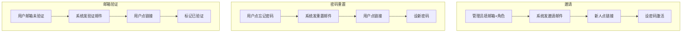

把动词去掉，三者结构惊人地一致：

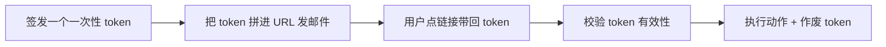

差别只在**「执行动作」那一步**：邀请是激活账号、重置是改密码、验证是打个时间戳。所以 SwarmHive 把它们抽象成**一张表 + 一个服务**，三个流程只是这套基建上的三种 `purpose`。

---

## 1. 一张表装下三种 token

`account_token` 表的核心字段：

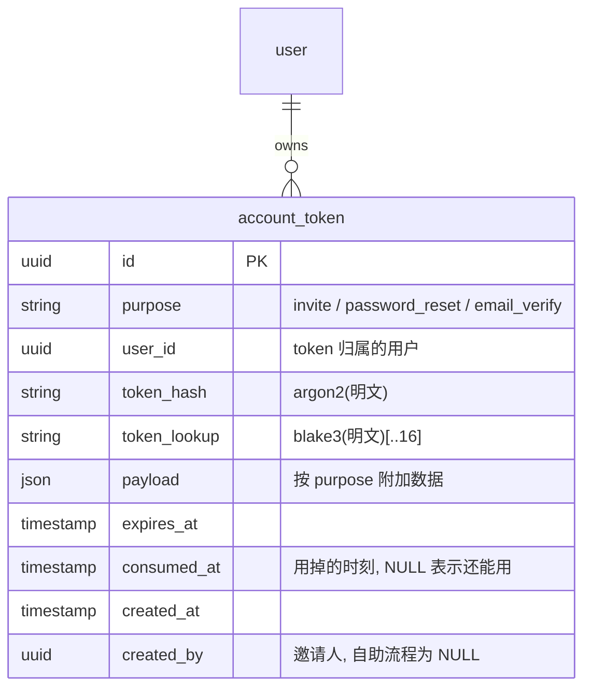

为什么不分三张表？因为它们的字段、生命周期、校验逻辑**完全一样**，只有 `purpose` 和 TTL 不同。分三张表等于把同一段逻辑抄三遍。用一个 enum 区分 purpose，配一个 `payload` JSON 兜住差异（邀请在这里塞 `role_id`），就够了。

三种 purpose 的差异一览：

| purpose | TTL | user_id 指向 | 谁签发 | payload |
|---|---|---|---|---|
| `invite` | 72 小时 | 新建的被邀请人 | 管理员 | `{ role_id }` |
| `password_reset` | 1 小时 | 重置的账号 | 用户自己 | 无 |
| `email_verify` | 24 小时 | 验证的账号 | 用户自己 | 无 |

---

## 2. 核心难题：token 怎么存？

这是整个设计最值钱的部分。token 明文会出现在邮件链接里（`?token=xxxx`），用户点链接带回来。问题是：**服务端该怎么存这个 token，才能在用户带回来时认出它？**

### 朴素方案的两难

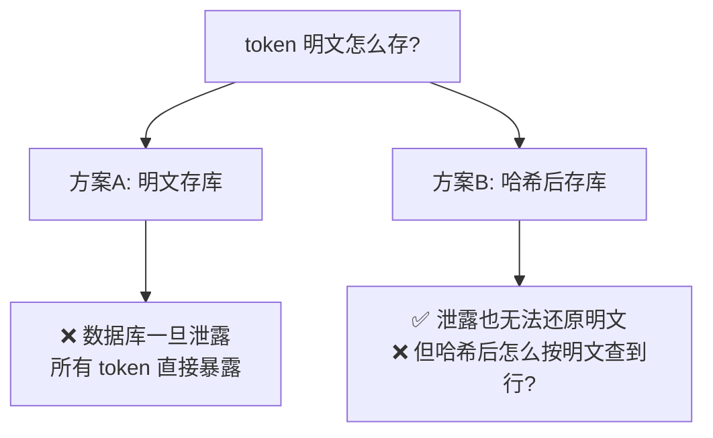

- **明文存**：用户带回明文，`WHERE token = ?` 一查就到。但 DB 一旦被拖库，所有有效 token 直接泄露，攻击者能冒用任何邀请/重置链接。
- **哈希存**：存 `hash(明文)`，拖库也还原不出明文。但**哈希不可索引**——你不知道用户带回的明文对应哪一行，只能把全表每一行都 `verify` 一遍，慢到无法接受。

而且密码级哈希（argon2 / bcrypt）每次校验要几十毫秒（故意设计得慢，防爆破），全表逐行 verify 等于自杀。

### SwarmHive 的解法：双层哈希

同时存**两个**派生值，各司其职：

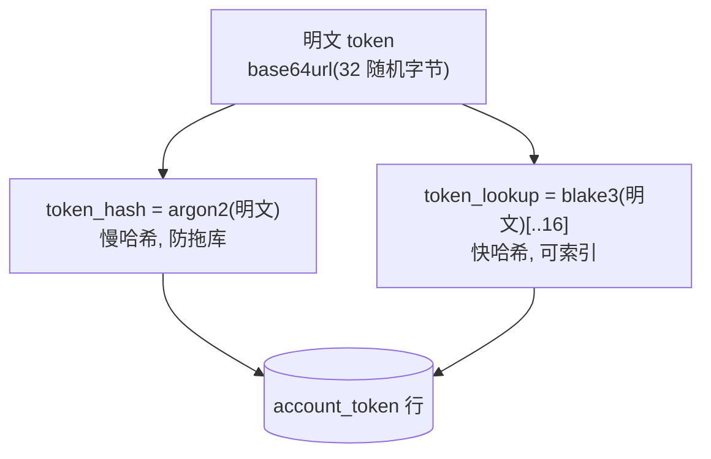

- `token_lookup`：blake3 快哈希取前 16 字节，**建索引**。它的作用是"定位"——用户带回明文，先 `WHERE (purpose, token_lookup) = ?` 用索引 O(1) 找到候选行。16 字节足够让碰撞概率小到可忽略，同时它是单向哈希、不加盐，泄露也推不回明文。
- `token_hash`：argon2 慢哈希，**最终裁判**。找到候选行后，只对**这一行**做一次 argon2 verify。拖库时它保证明文不可还原。

校验时序：

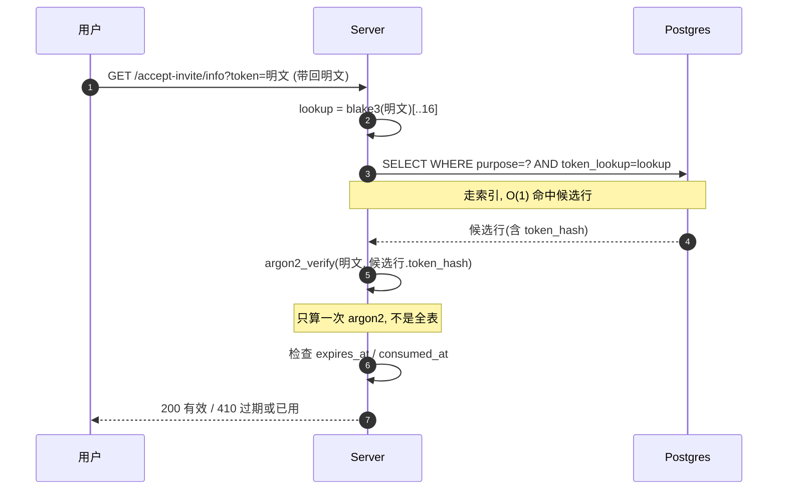

一句话总结：**blake3 负责"快速找到你"，argon2 负责"确认真的是你"，明文永不落库。** 这就避开了"哈希不可索引"和"明文不能存"的两难。

> 为什么用 blake3 不用 sha256？性能更好、抗碰撞同级、依赖更轻（项目里本来就有）。

### 一个用户、一个 purpose、只能有一个活 token

如果用户连点三次"忘记密码"，会签发三个有效 token 吗？不会。SwarmHive 强制**「每个 (user_id, purpose) 至多一个未消费 token」**：

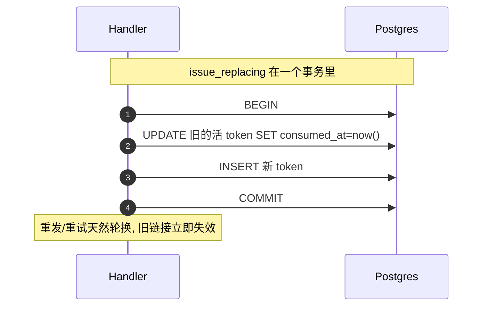

这个不变式由服务层 `issue_replacing()` 在事务内保证，**没有用数据库的 partial unique index**——因为当前用的 sea-orm 2 RC 版本对 `WHERE consumed_at IS NULL` 这种条件唯一索引的 schema 同步有 bug。应用层事务能达到同样效果。

---

## 3. 流程一：邀请

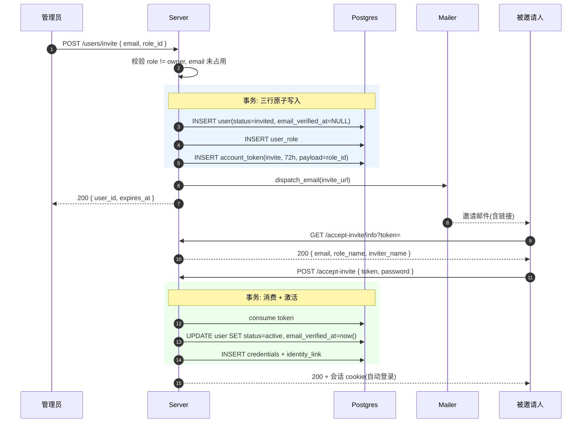

两个细节：

- **被邀请人一接受就顺带验证了邮箱**（`email_verified_at = now()`）。因为他能点开邮件里的链接，本身就证明了邮箱可达——没必要再让他单独验证一次。
- 校验里 `role != owner`：Owner 角色是部署初始化（bootstrap）专属，不能通过邀请产生，否则就有了第二条造 Owner 的路径。

「重发邀请」复用 `issue_replacing`，旧 token 立即失效，新邮件带新 token。

---

## 4. 流程二：密码重置（陷阱最多）

密码重置最容易写出安全漏洞，核心是两个：**邮箱枚举** 和 **会话劫持**。

### 陷阱 1：邮箱枚举

如果"邮箱不存在"返回不一样的响应（404、或更快的响应时间），攻击者就能批量探测"哪些邮箱在你系统注册过"。所以 `forgot-password` **无论如何都返回一样的 200**：

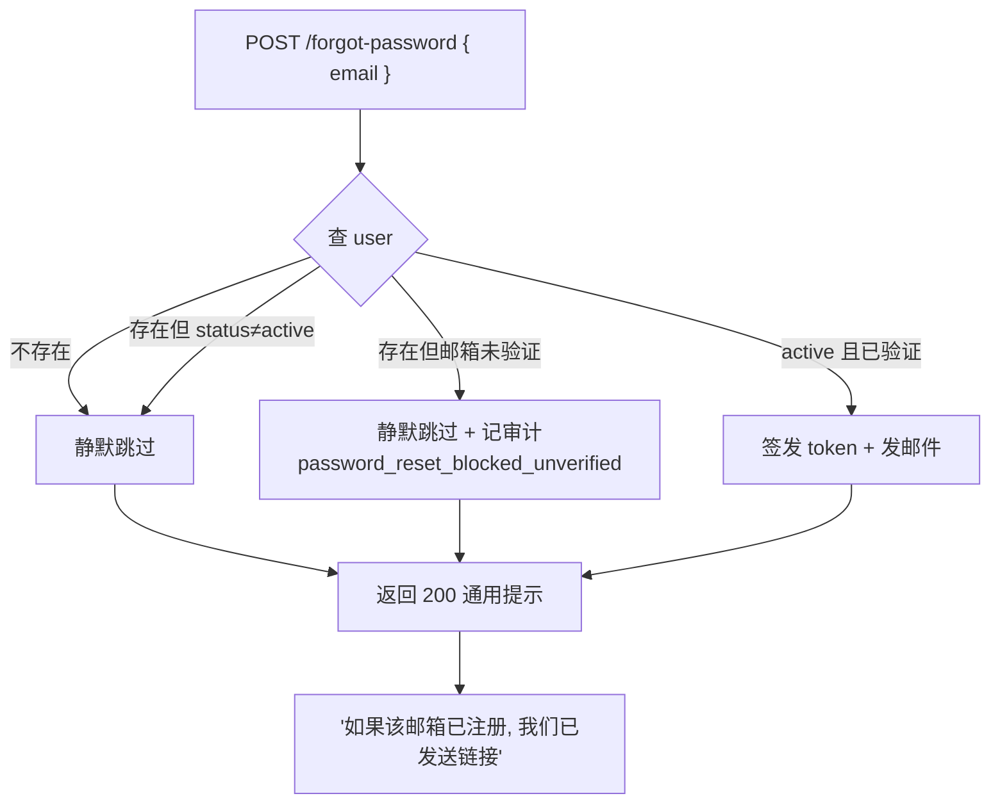

注意三条「跳过」路径还做了一件事：**时间对齐**。真正发邮件那条路要算 argon2、连 SMTP，耗时几十到几百毫秒；跳过路径几乎瞬间返回。如果不处理，攻击者用响应时间就能区分"发了 vs 没发"。所以跳过路径会 sleep 到一个统一的时间地板（`FORGOT_TIMING_FLOOR = 150ms`），抹平差异。

为什么「邮箱未验证」也要挡？因为如果有人注册时填错了邮箱（填成别人的），未验证状态下还能重置密码的话，真正的邮箱主人就能"重置"并劫持这个账号。**验证过邮箱 = 证明了邮箱归属**，这是能重置的前提。

### 陷阱 2：会话劫持

密码被重置了，说明很可能账号已经被盯上。这时如果攻击者之前已经登录（持有有效会话 cookie），改密码并不会踢掉他。所以重置时要**撤销该用户所有现存会话**：

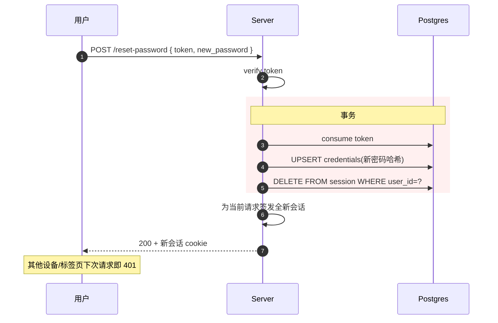

集成测试里就专门验证了这一点：用旧 cookie 调 `/me`，重置后必须返回 401。

---

## 5. 流程三：邮箱验证（软验证）

邮箱验证有"硬"和"软"两派：

- **硬验证**：不验证就不让用（登录即跳验证页，寸步难行）。
- **软验证**：验证前照常用，只是顶部挂个提醒条，某些敏感操作（如密码重置）才卡住。

SwarmHive 走软验证，参考 Cal.com / Mattermost——**别因为一封可能进垃圾箱的邮件，把用户挡在产品门外**。

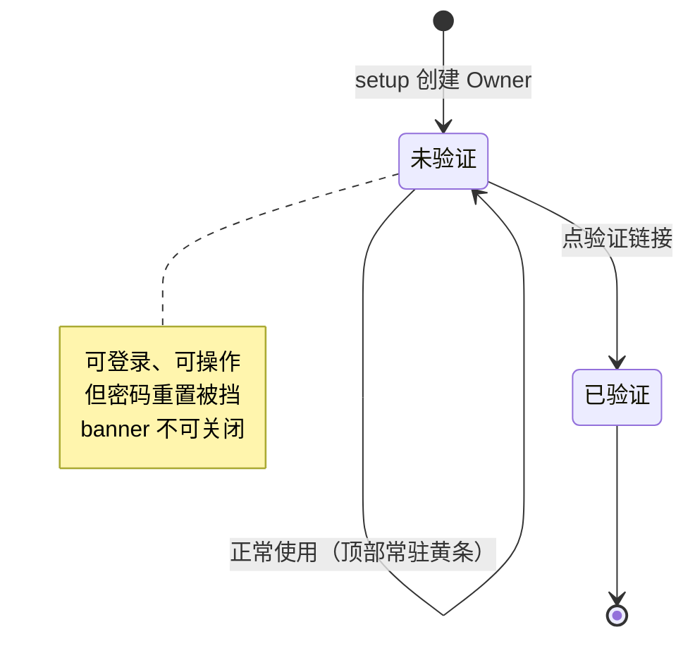

发送验证邮件这一步有三道闸：

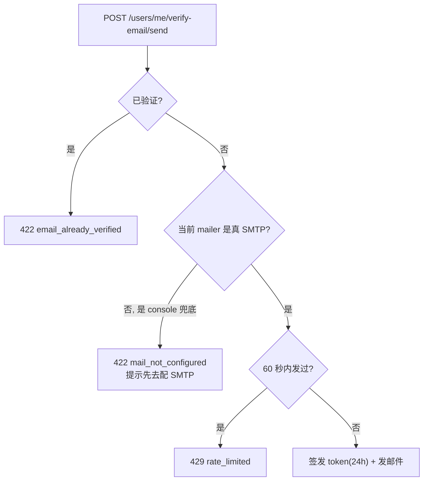

第二道闸很关键：如果服务端当前根本没配真实 SMTP（用的是兜底的 console mailer），发了也是白发，所以直接 422 让用户先去 `/settings/mail` 配。

消费时用一个幂等的条件更新：

```sql
UPDATE "user" SET email_verified_at = now()
WHERE id = ? AND email_verified_at IS NULL
```

再点一次旧链接也不会重复打时间戳，token 也已消费返回 410。

---

## 6. 前端：四个公开页 + 一个提醒条

token 链接落地的页面必须是**公开的**（用户还没登录就在点）：

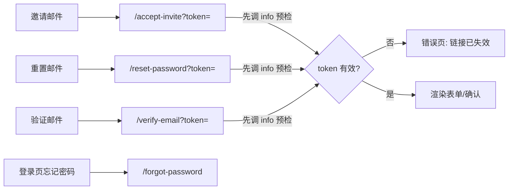

每个页面落地先调一个 `.../info` 只读接口**预检** token——有效才渲染表单，无效（过期/已用）直接显示"链接已失效"，不让用户白填一遍密码才被拒。

登录后的「邮箱未验证」提醒条挂在统一布局顶部，根据邮件配置状态切换文案：

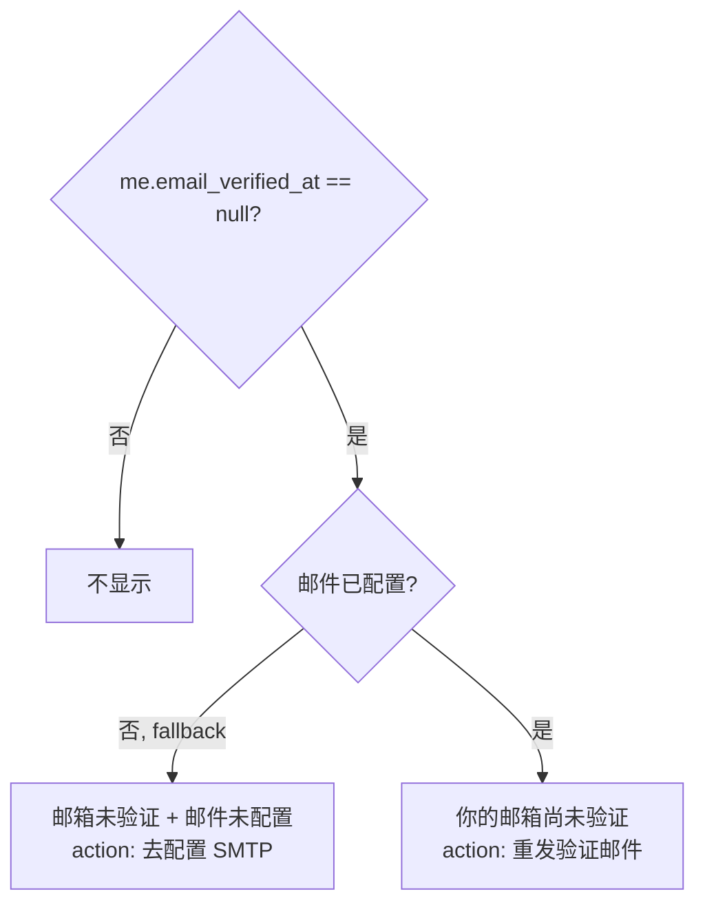

「重发验证」这个动作在提醒条和「设置→账户」页都有，所以抽成一个共享 hook（`useResendVerify`），把三种错误（已验证 / 限流 / 邮件未配置）的提示文案统一处理，成功后让 `/me` 查询失效、提醒条自然消失。

---

## 7. 错误怎么传：RFC 9457

token 的几种失败状态用 [RFC 9457](https://www.rfc-editor.org/rfc/rfc9457) 的 `problem+json` 表达，带类型化的 `type` URI，前端按 `type` 分支处理：

| 情况 | HTTP | type |
|---|---|---|
| token 不存在 | 404 | `about:blank` |
| token 过期 | 410 | `.../errors/token-expired` |
| token 已用 | 410 | `.../errors/token-already-consumed` |
| 已验证还发验证 | 422 | `.../errors/email-already-verified` |
| 邮件未配置 | 422 | `.../errors/mail-not-configured` |
| 发送限流 | 429 | `.../errors/rate-limited` |

`TokenError → ApiError` 的映射**集中在服务层一处**实现，handler 里直接 `?` 往上抛，不用每个调用点重复 match。

---

## 8. 怎么测：用一个"捕获型" Mailer

集成测试最大的难点：**token 明文只存在于邮件里**（数据库只有哈希），测试怎么拿到明文去走后续流程？

答案是注入一个假 Mailer，它不真发邮件，只把"信封"（含拼好 token 的 URL）记到内存里：

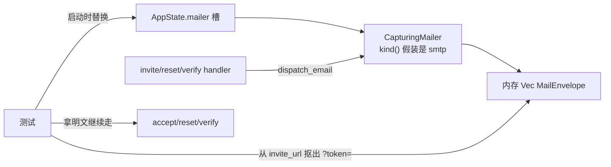

`CapturingMailer` 的 `kind()` 返回 `"smtp"`，正好骗过验证邮件那道"必须是真 SMTP"的闸。`account_token_smoke.rs` 用这招覆盖了 9 个端到端场景：邀请→接受→登录、重复邀请被拒、重发轮换、忘记→重置→旧会话失效、未验证静默跳过、验证→消费→二次 410、限流 429、未配置 422。

---

## 9. 小结

把三个流程铺开看，复用点其实很清晰：

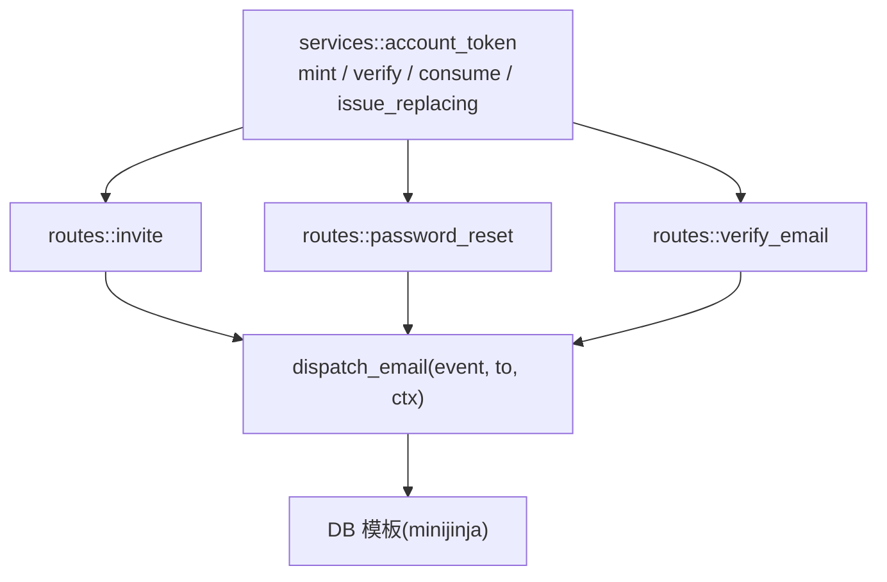

设计要点回顾：

1. **一张表 + 一个服务**，三流程只是 `purpose` 不同——别为相同的逻辑分表。
2. **argon2 + blake3 双层哈希**：慢哈希防拖库，快哈希做索引，明文永不落库。
3. **每个 (user, purpose) 一个活 token**，事务内轮换，旧链接即时失效。
4. **密码重置防两个坑**：统一响应 + 时间地板防邮箱枚举；撤销全部会话防劫持。
5. **软验证**：不挡正常使用，只挡敏感操作；未验证邮箱不能重置密码。
6. **明文只在邮件里**——测试用捕获型 Mailer 把信封截下来拿 token。

下一篇我会写一个更接地气的实战：[**怎么用 Brevo 白嫖一个每天 300 封的免费 SMTP，以及我们在接入时踩的一连串坑**](./2026-05-28-brevo-free-smtp-provider-setup.md)——端口被运营商封、密码格式不对、发到本地 mailpit 还浑然不觉……每一个都够你 debug 半天。

**相关代码**：`crates/swarmhive-server/src/services/account_token.rs`、`crates/swarmhive-entity/src/account_token.rs`、`crates/swarmhive-server/src/routes/{invite,password_reset,verify_email}.rs`、`apps/admin/src/routes/{forgot-password,reset-password,accept-invite,verify-email}.tsx`、`crates/swarmhive-server/tests/account_token_smoke.rs`。
