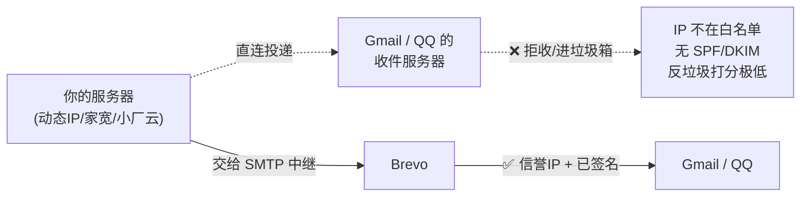
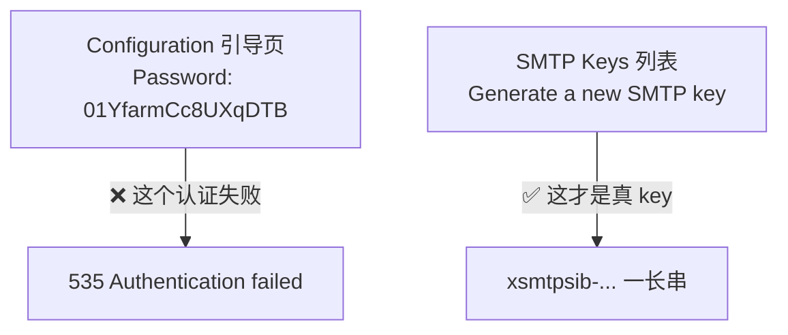
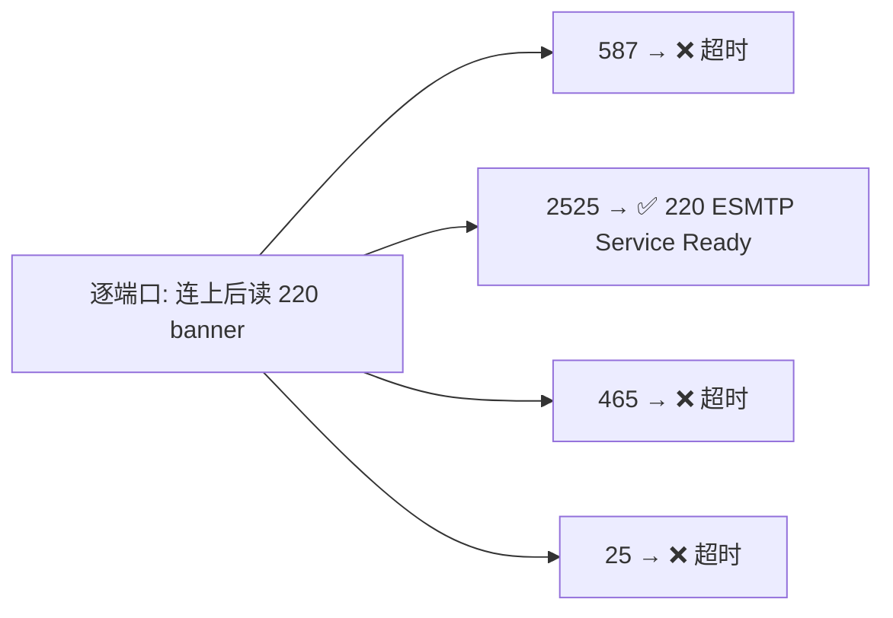
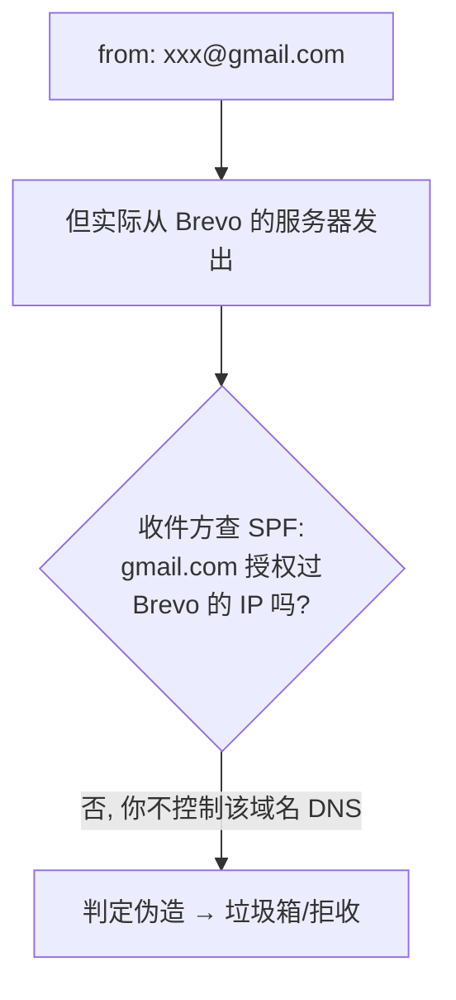
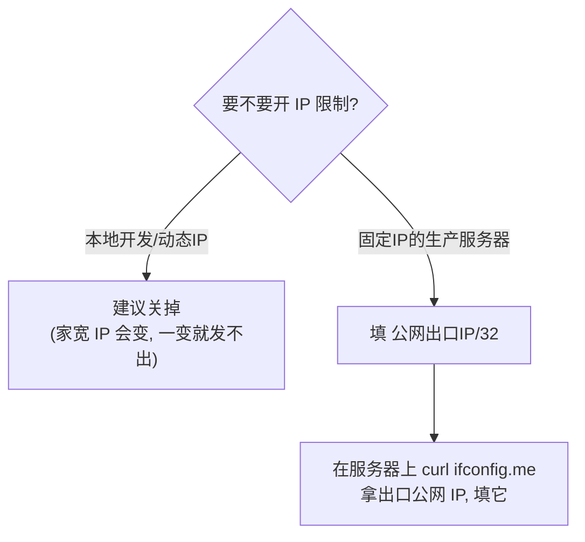
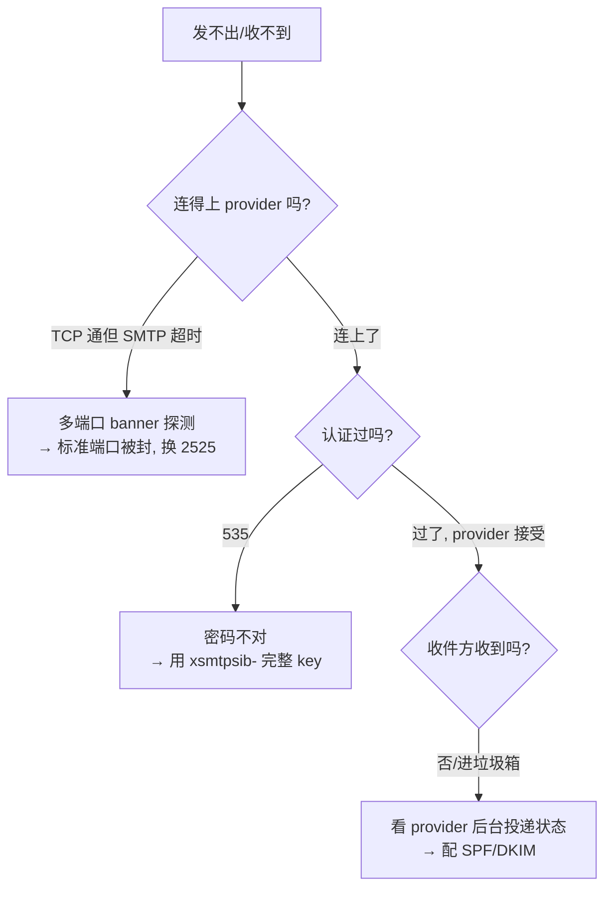

# 用 Brevo 配一个每天 300 封的免费 SMTP —— 从注册到发出第一封的完整避坑指南

> 写在前面：给自己的项目发事务邮件（注册验证、密码重置、通知），又不想花钱、也不想自建 Postfix？[Brevo](https://www.brevo.com)（原 Sendinblue）每天免费 300 封，对绝大多数小项目 / 自托管应用绰绰有余。
>
> 但从注册到真正把邮件投进收件箱，中间有几个**不显眼的坑**——填错了不会有友好提示，只会"看起来发了却收不到"。这篇带你一次踩平。**文中所有坑都在 Brevo / 通用 SMTP 层面，与你用什么语言、什么框架无关。**

---

## 0. 为什么不能自己发，要找中继

先建立一个认知：**你几乎不可能用自己的服务器直接把邮件投到 Gmail / QQ**。



收件方判断"这封信是不是垃圾"，看的是**发信 IP 的历史信誉**、**SPF**（这个 IP 有没有被授权代发该域名）、**DKIM**（内容有没有被域名私钥签名）。这些专业 SMTP 中继都帮你养好、配好了。你只要用 SMTP 协议把邮件**交给**它，跨网投递、重试、退信、反垃圾签名这些脏活它全包。

这就是为什么要挂一个第三方 SMTP provider，而不是自己 `connect(gmail, 25)`。

---

## 1. 为什么选 Brevo

自托管发的都是低频事务邮件，量很小，免费额度足够：

| 服务 | 免费额度 | 备注 |
|---|---|---|
| **Brevo** | **300 封/天**（永久） | 本文主角，无需信用卡，按天给量 |
| Mailjet | 200 封/天 / 6000 封/月 | 老牌 |
| Resend | 100 封/天 / 3000 封/月 | 现代，需验证域名 |
| Amazon SES | 不免费但极便宜 | 约 0.1 美元/千封 |

Brevo 的优势：**按天 300 封、永久免费、不要信用卡**。一天发几十封验证 / 重置邮件，完全够。

---

## 2. 拿 SMTP 凭证：Login 不是你的注册邮箱

注册 Brevo 后，进 **SMTP & API → SMTP**，看到四个值：

```text
SMTP server : smtp-relay.brevo.com
Port        : 587
Login       : acc496001@smtp-brevo.com     ← 坑! 这不是你的注册邮箱
Password    : (一个值)
```

**第一个坑**：`Login` 是 Brevo 分配给你的 SMTP 账号（形如 `accXXXXXX@smtp-brevo.com`），**不是**你注册 Brevo 用的那个邮箱。很多人下意识填注册邮箱，然后认证失败一脸懵。

记住：SMTP 认证的用户名 = 这个 `accXXXXXX@smtp-brevo.com`。

---

## 3. 密码坑：引导页那个"Password"可能不是 key

这是最坑的一个。Brevo 界面里有**两处**都显示"密码样的东西"，但只有一个能用：



真正的 SMTP key 格式是 **`xsmtpsib-` 开头的一长串**（如 `xsmtpsib-27c498...EGGey4YoWagNWL02`）。如果你用引导页那个短短的串去认证，会撞 `535 Authentication failed`。

**正确做法**：去 **SMTP Keys** 列表，点 `Generate a new SMTP key`，它**只完整显示一次**，立刻复制那个 `xsmtpsib-...`。分不清就直接新生成一个——新建的一定有效、且完整显示一次。

认证成功长这样：

```text
235 2.0.0 Authentication succeeded
250 Roger, accepting mail from <...>
250 OK: queued as <...@smtp-relay.sendinblue.com>
```

---

## 4. 端口坑：587 被运营商"假连通"

配好凭证后如果发不出去、还卡住不报错，**大概率是端口被封**——尤其在国内网络。

最迷惑的是：用 `nc` / `telnet` 测端口，**看起来是通的**：

```bash
nc -z -v -w 5 smtp-relay.brevo.com 587
# → Connection to smtp-relay.brevo.com port 587 succeeded!
```

但实际一连上去读 SMTP 欢迎语就超时。原因：`nc -z` 只验证了 **TCP 三次握手**（SYN-ACK），而**应用层的 SMTP 数据被运营商掐断了**。国内运营商普遍对标准 SMTP 端口（**25 / 587 / 465**）做应用层封锁——允许你建 TCP 连接，但不让真正的邮件协议跑。

写个多端口探测，看哪个端口能拿到**真实的 SMTP banner**：



```python
import socket, ssl
for port in [587, 2525, 465, 25]:
    try:
        s = socket.create_connection(("smtp-relay.brevo.com", port), timeout=8)
        if port == 465:  # 隐式 TLS
            s = ssl.create_default_context().wrap_socket(s, server_hostname="smtp-relay.brevo.com")
        s.settimeout(8)
        print(f"{port}: ✅ {s.recv(200)!r}")
    except Exception as e:
        print(f"{port}: ❌ {type(e).__name__}: {e}")
```

结果往往**只有 2525 通**。Brevo（以及多数 SMTP 服务）正是为了应对端口封锁，额外提供 **2525** 这个非标准端口——它不在运营商的封锁名单里。

**解法**：端口用 **2525**，加密仍是 STARTTLS。

> 记住：`nc -z` / `telnet` 显示端口"通"只代表 TCP 通，不代表 SMTP 通。测 SMTP 要测到能收 `220` banner 为止。

---

## 5. 发件地址坑：SPF/DKIM 不对齐 → 进垃圾箱

认证通过、Brevo 也接受了（`250 queued`），但收件人还是没在收件箱看到——这不是 bug，是**邮件认证**问题。

假设你的发件地址用了 `xxx@gmail.com`：



你不拥有 `gmail.com` 的 DNS，没法给 Brevo 配 SPF / DKIM 记录，于是收件方（尤其 QQ 这种严格的）发现"自称 gmail.com 却从 Brevo 的 IP 发来"，判定可疑，丢垃圾箱。

**解法**（按可靠度）：

1. **最佳**：用你**自己拥有的域名**，在 Brevo **验证整个域名**并按它给的记录配好 **SPF + DKIM**（可选 DMARC），发件地址用 `noreply@你的域名`。投递率才正常。
2. **临时验证链路**：去 Brevo **Senders** 把某个邮箱地址验证掉（Brevo 会发确认邮件，点一下即可），能发出但仍可能进垃圾箱——只用来确认"链路通了"。

> 一句话：`from` 地址必须是你**能配 DNS** 的域名，否则 SPF/DKIM 永远对不齐。拿 gmail / qq 当 `from` 走第三方中继是经典翻车点。

---

## 6. IP 授权坑：Brevo 的 Authorized IPs

Brevo 有个可选安全功能——限制"哪些源 IP 能用你的 key 发信"。它弹出的对话框示例写着 `192.168.1.0/24`，**但那是私有网段，填它没用**——你的服务器连 Brevo 走的是公网，必须填**公网出口 IP**。



- **本地开发 / 家宽**：出口 IP 是动态的，过几天就变，变了就发不出去。**建议直接关掉 IP 限制**省心。
- **固定 IP 的生产服务器**：在服务器上 `curl ifconfig.me` 拿到出口公网 IP，填 `<那个IP>/32`（精确锁定单个 IP）。
- 注意填的是**运行你应用的机器**的出口 IP，不是你浏览器所在的机器；NAT/容器后面也填出口公网 IP，别填 `10.x` / `172.x` / `192.168.x` 这些内网地址。

---

## 7. 通用排查三件套

接任何第三方 SMTP 都能用这套工具：



1. **多端口 banner 探测**（第 4 节脚本）：区分"TCP 通"和"SMTP 通"，定位端口封锁。
2. **直连发一封，开 debug**：用 Python `smtplib` 开 `set_debuglevel(1)`，完整 SMTP 对话（每个响应码）一览无余，能精确定位是认证（535）、发件人还是收件人被拒：

   ```python
   import smtplib
   from email.mime.text import MIMEText

   msg = MIMEText("hello from brevo", "plain", "utf-8")
   msg["Subject"] = "brevo test"
   msg["From"] = "noreply@你的域名"
   msg["To"] = "you@example.com"

   s = smtplib.SMTP("smtp-relay.brevo.com", 2525, timeout=20)
   s.set_debuglevel(1)            # 打印完整 SMTP 对话
   s.starttls()
   s.login("accXXXXXX@smtp-brevo.com", "xsmtpsib-....")
   s.sendmail(msg["From"], [msg["To"]], msg.as_string())
   s.quit()
   ```

3. **看 Brevo 后台 Logs**：**Transactional → Logs / Statistics** 是投递状态的权威来源。你的应用显示"已发送"只代表 Brevo 收下了；这封最终是 `delivered` / `spam` / `bounce`，以后台为准。

---

## 8. 接入 checklist

配 Brevo（或任何第三方 SMTP）发邮件，确认这几条：

- [ ] 用户名是 Brevo 的 SMTP **Login**（`accXXX@smtp-brevo.com`），不是你的注册邮箱
- [ ] 密码是 `xsmtpsib-...` 那种**完整 SMTP key**，不是引导页的短串；分不清就重新生成
- [ ] 端口：国内网络优先 **2525**（587 / 465 / 25 常被运营商封）；用 banner 探测确认
- [ ] 加密：2525 / 587 用 **STARTTLS**，465 用隐式 TLS
- [ ] 发件地址是你**能配 DNS** 的域名，并在 Brevo 验证域名 + 配 SPF / DKIM
- [ ] 若开了 IP 限制：填**公网出口 IP/32**，不是私有网段；动态 IP 建议直接关
- [ ] 发完去 **Brevo 后台 Logs** 看真实投递状态，别只信自己应用的"已发送"

把这七条对一遍，基本就能把第一封邮件稳稳投进收件箱了。
