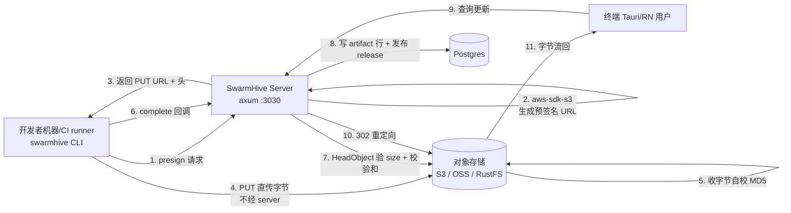
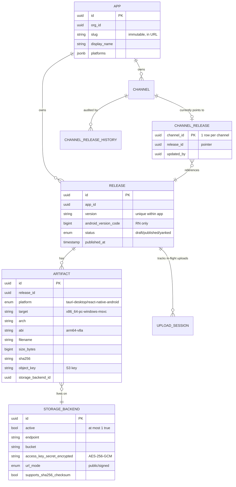
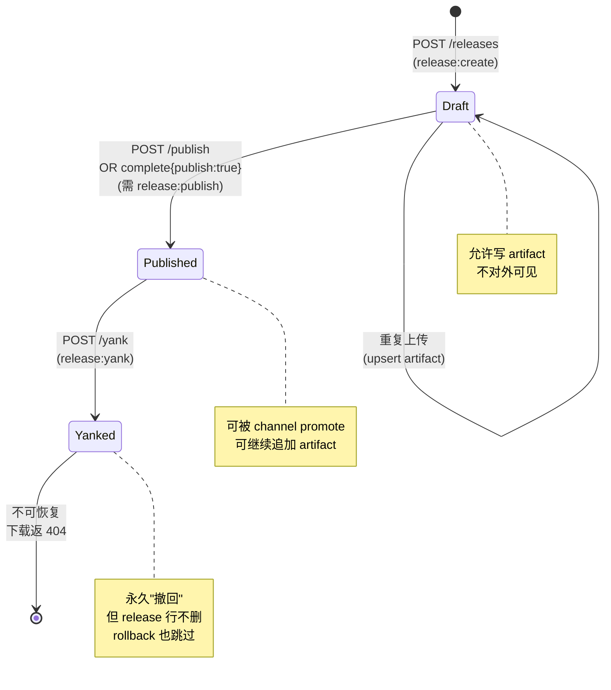
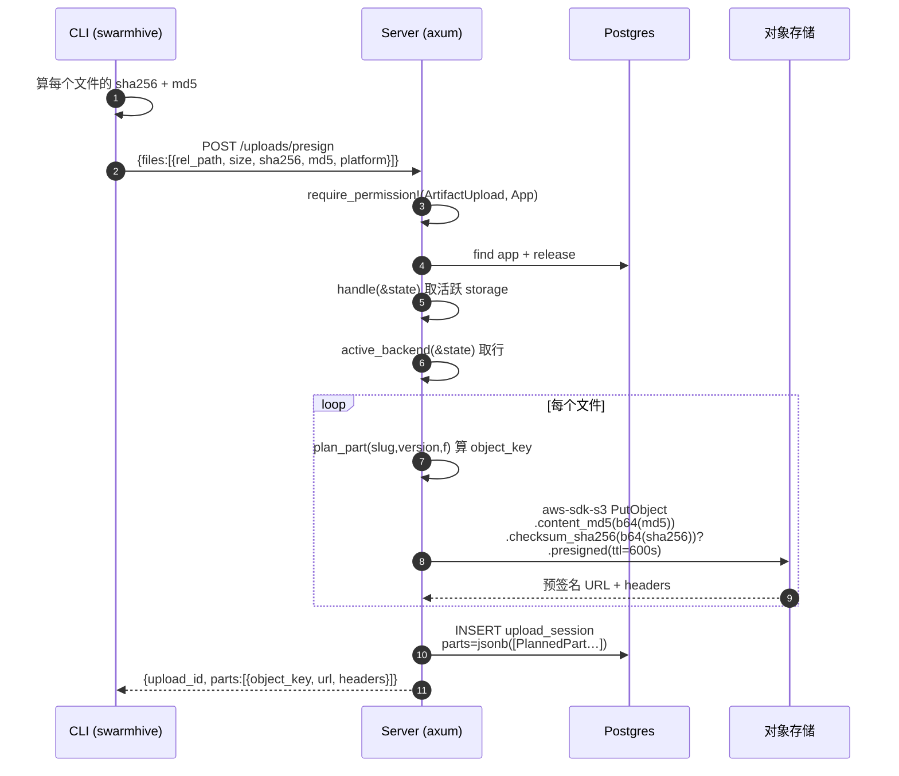
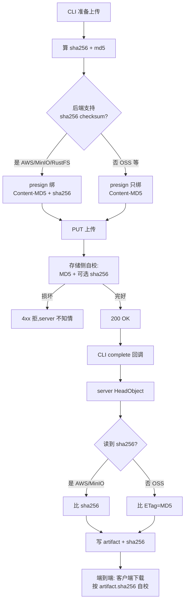
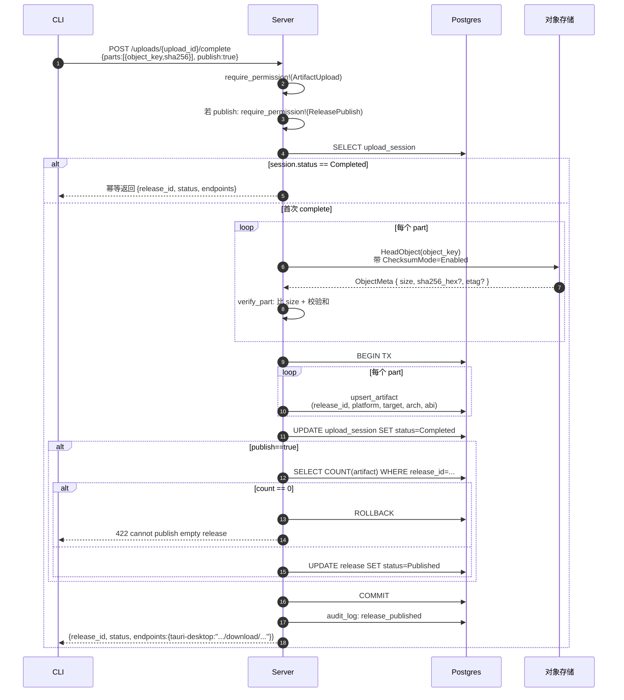
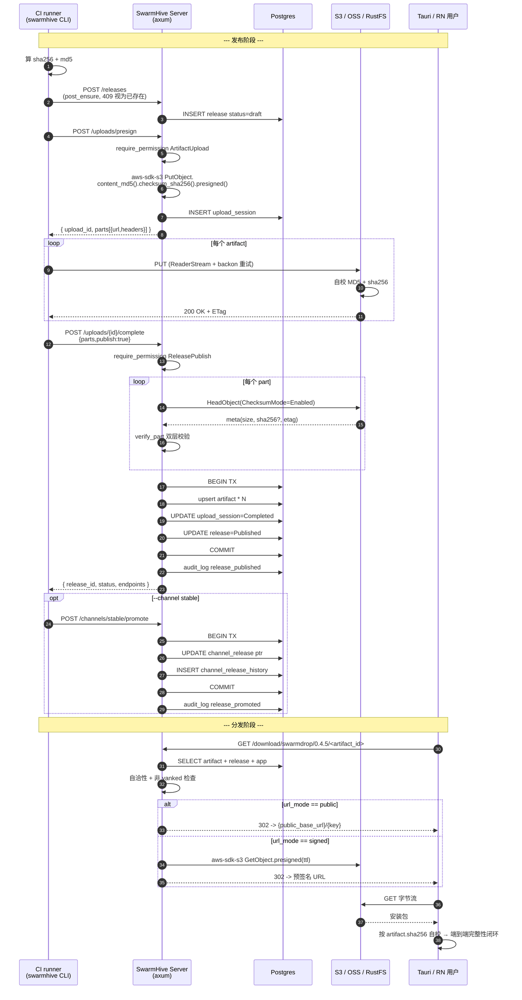

# SwarmHive 如何用对象存储承载 Release 与 Artifact —— 一篇从协议到代码的深度解剖

> 写在前面：自托管的"应用更新中心"听上去是个老问题，但只要细看就会发现里面藏着一堆容易踩雷的细节——CLI 上传是不是要经过 server 中转字节？怎么保证文件没在网络里被翻车？阿里云 OSS 那点行业老黄历跟 AWS S3 在 checksum 上对得齐吗？回滚到底是真删产物还是只改一个指针？
>
> 本文以 [SwarmHive](https://github.com/swarm-apps/swarmhive) 落地的 [`add-storage-and-presign-upload`](../../openspec/changes/) + [`add-app-release-artifact`](../../openspec/changes/) 两个 proposal 为蓝本，把 Release / Artifact / Channel / StorageBackend 这四张表怎么和 S3 兼容对象存储扣在一起，逐步拆解给你看。
>
> 读完应该能：
>
> 1. 看懂"presign 直传 + complete 回调"这一类 server 零字节中转的上传链路怎么写
> 2. 理解为什么 SwarmHive 用 **Content-MD5 + 机会主义 SHA-256** 双层校验，以及 OSS 那道兼容性墙在哪
> 3. 知道 `aws-sdk-s3` / `async_trait` / `sea-orm` / `tokio_util::ReaderStream` / `backon` 各自负责的工作
> 4. 学会"channel 是指针不是产物属性"这种发布列车模型，以及它对存储路径的影响

---

## 0. 一次 `swarmhive publish` 真正经历了什么

先建立物理直觉。开发者在 CI 里跑 `swarmhive publish tauri`，三十秒后 Tauri 用户能收到自动更新——这中间到底有几个角色在动？



要点先记住三件事：

- **server 全程不碰产物字节**。无论 100 MB 的 Windows 安装包还是 80 MB 的 APK，都是 CLI 跟对象存储直连 PUT 完，再回报 server。
- **完整性校验在存储侧强制执行**，server 不二次下载验 hash——只发一次 `HeadObject` 看 size + 校验和元数据。
- **下载也是 302 转过去**，server 只是个签名 URL 生成器，对真实带宽零占用。

这三点决定了 SwarmHive 单 binary（embed admin SPA 那个）能用一台 1C2G 的小机器扛住一个企业的发布流量——而不是变成"昂贵的 nginx 反代"。

---

## 1. 数据模型：四张表 + 一张 history

进代码之前，先把"谁拥有谁"这件事讲清楚。SwarmHive 的发布域 5 张核心表如下（来自 [crates/swarmhive-entity/src/](../../crates/swarmhive-entity/src/)）：



几个第一眼容易被绊到的设计点：

### 1.1 release 和 channel 是**完全解耦**的

很多人第一反应：「stable 这个 channel 跑的是 0.4.5，所以 release `0.4.5` 上肯定挂个 `channel='stable'` 字段对吧？」

**错。** 看 [`channel_release.rs`](../../crates/swarmhive-entity/src/channel_release.rs#L10-L23)：

```rust
#[sea_orm(table_name = "channel_release")]
pub struct Model {
    #[sea_orm(primary_key, auto_increment = false)]
    pub channel_id: Uuid,        // ← PK 就是 channel_id,每 channel 至多一行
    pub release_id: Uuid,        // ← 这才是「当前服务的 release」
    pub updated_at: DateTimeUtc,
    pub updated_by: Uuid,
}
```

**channel 是一个独立指针**——指向当前服务的某个 release。promote `stable` 到 `0.4.5` 就是 update 这一行；rollback 到 `0.4.4` 还是 update 这一行。同一个 release 可以同时被 `dev`、`beta`、`stable` 三个 channel 指向。

这种"发布列车"模型的代价（你必须维护一张 [channel_release_history](../../crates/swarmhive-entity/src/channel_release_history.rs)）远小于它带来的好处：

- **promote / rollback 零存储动作**：产物只上传一次，channel 切换只改一行 Postgres。
- **永不删 release**：rollback 是改指针，不是删历史；想"重新拿出来"的时候直接再 promote 一次。
- **对象路径不带 channel**：`apps/{slug}/versions/{version}/{platform}/{variant}/{filename}`。

最后一点你能在 [`routes/uploads/service.rs::object_key`](../../crates/swarmhive-server/src/routes/uploads/service.rs#L52-L64) 里直接看到代码：

```rust
pub(super) fn object_key(slug: &str, version: &str, f: &PresignFile) -> String {
    let variant = f.target.clone()
        .or_else(|| f.abi.clone())
        .or_else(|| f.arch.clone())
        .unwrap_or_else(|| "any".into());
    format!(
        "apps/{slug}/versions/{version}/{}/{variant}/{}",
        platform_str(f.platform),
        filename_of(&f.relative_path)
    )
}
```

注意里面**没有 channel**。这一刀切下去的连锁效果就是上面说的：promote 时一个字节都不用搬。

### 1.2 artifact 是 release 的子项，平台 + variant 唯一

[`artifact.rs`](../../crates/swarmhive-entity/src/artifact.rs#L42-L57) 的复合唯一键长这样：

```rust
#[sea_orm(table_name = "artifact")]
pub struct Model {
    #[sea_orm(primary_key, auto_increment = false)]
    pub id: Uuid,
    #[sea_orm(unique_key = "release_variant")]
    pub release_id: Uuid,
    #[sea_orm(unique_key = "release_variant")]
    pub platform: Platform,
    #[sea_orm(unique_key = "release_variant")]
    pub target: Option<String>,
    #[sea_orm(unique_key = "release_variant")]
    pub arch: Option<String>,
    #[sea_orm(unique_key = "release_variant")]
    pub abi: Option<String>,
    pub filename: String,
    pub size_bytes: i64,
    pub sha256: String,
    pub storage_backend_id: Uuid,
    pub object_key: String,
    // ...
}
```

`release_id + platform + target + arch + abi` 五元组复合唯一。这意味着同一个 release 0.4.5 里：

- Windows x86_64 安装包 — 1 行
- macOS aarch64 dmg — 1 行
- macOS x86_64 dmg — 1 行
- arm64-v8a APK — 1 行

…各占一行。重复 `swarmhive publish`（比如 CI 重跑）走 `complete` 时是 upsert，按这五元组找到对应行原地 update，不会插重复（见 [`routes/uploads/service.rs::upsert_artifact`](../../crates/swarmhive-server/src/routes/uploads/service.rs#L171-L220)）。

### 1.3 release 状态机：draft → published →（→ yanked）

[`release.rs`](../../crates/swarmhive-entity/src/release.rs#L15-L25)：



`status = yanked` 是**软删除**——release 行还在，artifact 行还在，对象存储里的字节也还在。只是 [`download` handler](../../crates/swarmhive-server/src/routes/download.rs#L43-L46) 看见 yanked 就返 404：

```rust
// 被 yank 的 release 不再对外分发。
if rel.status == release::ReleaseStatus::Yanked {
    return Err(ApiError::NotFound);
}
```

为什么不真删？两个理由：

1. **审计**：「这个版本曾经发出去过、又被撤回」是一条需要留痕的事实。
2. **rollback 能跳过它**：rollback 默认拿"上一条 distinct release"，跳过当前指向；如果有 yanked，正好顺势绕开。

---

## 2. Storage 抽象层：把 S3 / OSS / RustFS / MinIO 装进一个 trait

SwarmHive 的"硬约束"之一是 **S3 兼容是唯一正式存储后端**（来自 [`docs/03-architecture.md`](../../docs/03-architecture.md)）。这条决策的全部 RoI 都体现在 [`crates/swarmhive-server/src/storage/mod.rs`](../../crates/swarmhive-server/src/storage/mod.rs)：

```rust
#[async_trait]
pub trait Storage: Send + Sync {
    async fn presign_put(
        &self,
        object_key: &str,
        expected_sha256_hex: &str,
        expected_md5_hex: &str,
        ttl_secs: u64,
        with_checksum: bool,
    ) -> Result<PresignedPut, StorageError>;

    async fn head(&self, object_key: &str) -> Result<ObjectMeta, StorageError>;

    fn public_url(&self, object_key: &str) -> String;
    async fn signed_get(&self, object_key: &str, ttl_secs: u64) -> Result<String, StorageError>;
    async fn delete(&self, object_key: &str) -> Result<(), StorageError>;

    async fn probe(&self) -> Result<bool, StorageError>;
}

pub type StorageHandle = Arc<dyn Storage>;
```

六个方法，覆盖整个生命周期。底层唯一一个实现是 [`S3Storage`](../../crates/swarmhive-server/src/storage/s3.rs)（基于 `aws-sdk-s3`），跑遍 AWS S3、Cloudflare R2、阿里云 OSS、MinIO、RustFS、Garage 都只换 config 不换代码。

> 🧠 这里用了 `#[async_trait]` 而不是 Rust 1.75+ 原生 `async fn in trait`。原因：trait object（`Arc<dyn Storage>`）目前需要 `async_trait` 帮忙做 Box::pin 转换，原生 async trait 还不支持 dyn dispatch。

### 2.1 `async_trait` 速成 —— 为什么不能直接用原生 async fn

Rust 1.75 给 trait 加了 `async fn`，于是你可能想这样写：

```rust
pub trait Storage: Send + Sync {
    async fn head(&self, key: &str) -> Result<ObjectMeta, StorageError>;
}
```

然后试图 `Arc<dyn Storage>`，编译器会怼你：

```text
error: the trait `Storage` cannot be made into an object
       because method `head` is `async`
```

`async fn` 实际返回一个匿名的 opaque `impl Future`。每个 impl 的 future 类型不同、大小不同，无法在 trait object 里统一布局。`#[async_trait]` 宏的活就是**自动把 `async fn` 改写成 `fn ... -> Pin<Box<dyn Future<...> + Send>>`**——堆分配一个 boxed future，大小固定，可以 vtable 调用。

代价是每次方法调用一个 Box::pin（堆分配 + 间接跳转）。对于"每个 release publish 调一次 head_object"这种 QPS 级别，可忽略。

### 2.2 `aws-sdk-s3`：endpoint + path style 是适配 OSS / MinIO 的关键

[`s3.rs::from_backend`](../../crates/swarmhive-server/src/storage/s3.rs#L31-L53) 构造 client：

```rust
pub fn from_backend(model: &storage_backend::Model, secret_key: &SecretKey)
    -> Result<Self, StorageError>
{
    let secret = secret_key
        .decrypt(&model.access_key_secret_encrypted)
        .map_err(|e| StorageError::Build(format!("decrypt secret: {e}")))?;
    let creds = Credentials::new(model.access_key_id.clone(), secret, None, None, "swarmhive");
    let conf = aws_sdk_s3::config::Builder::default()
        .behavior_version(BehaviorVersion::latest())
        .region(Region::new(model.region.clone()))
        .endpoint_url(model.endpoint.clone())            // ← 自托管关键
        .credentials_provider(creds)
        .force_path_style(model.force_path_style)        // ← MinIO 关键
        .build();
    Ok(Self { client: Client::from_conf(conf), bucket, prefix, public_base_url })
}
```

两个对 self-host 至关重要的旋钮：

| 字段 | 作用 | 何时打开 |
|---|---|---|
| `endpoint_url` | 覆盖 AWS 默认 `https://s3.amazonaws.com` | **总是**（OSS / R2 / MinIO / RustFS 都不是 AWS） |
| `force_path_style` | 用 `https://endpoint/bucket/key` 而非 `https://bucket.endpoint/key` | MinIO/RustFS 通常开（DNS 子域不便），OSS/R2 关 |

`Credentials::new` 的第五个参数（`"swarmhive"`）是 provider name——AWS SDK 用来在 metric / 日志里区分凭据来源，不影响实际请求。

### 2.3 secret 不裸存：AES-256-GCM 加密落库

注意 `secret_key.decrypt(&model.access_key_secret_encrypted)`。`access_key_secret_encrypted` 列存的是 **AES-256-GCM 密文**（格式 `base64(nonce || ciphertext || tag)`），主密钥来自启动期 `SWARMHIVE_SECRET_KEY` 环境变量或 `config/local.toml`。同一把密钥之后会复用给 OAuth client_secret。

[`routes/storage.rs::create_backend`](../../crates/swarmhive-server/src/routes/storage.rs#L60-L93) 创建时就加密：

```rust
let secret_enc = state.secret_key.encrypt(&req.access_key_secret)?;
let model = storage_backend::ActiveModel {
    // ...
    access_key_secret_encrypted: Set(secret_enc),
    // ...
}.insert(&state.db).await?;
```

[`StorageBackendView`](../../crates/swarmhive-api-types/src/storage.rs#L17-L37) 对外只暴露 `secret_set: bool` 这一个布尔，永远不回传密文，连密文都不给。前端要"修改 secret"时显式留空表示"不动它"（见 [`update_backend`](../../crates/swarmhive-server/src/routes/storage.rs#L131-L133)）：

```rust
if let Some(secret) = req.access_key_secret.filter(|s| !s.is_empty()) {
    am.access_key_secret_encrypted = Set(state.secret_key.encrypt(&secret)?);
}
```

### 2.4 active backend 的 hot-swap：activate 之后立即生效，不重启

整个 SwarmHive 同时**只允许一个活跃 backend**。activate 接口（[`routes/storage.rs::activate_backend`](../../crates/swarmhive-server/src/routes/storage.rs#L206-L229)）的实现：

```rust
let txn = state.db.begin().await?;
storage_backend::Entity::update_many()
    .col_expr(storage_backend::Column::Active, Expr::value(false))
    .exec(&txn).await?;                          // ← 先全置 false
let mut am: storage_backend::ActiveModel = row.into();
am.active = Set(true);                           // ← 再置自己 true
let saved = am.update(&txn).await?;
txn.commit().await?;

storage::refresh(&state).await;                  // ← 热插拔 in-memory handle
```

`storage::refresh` 在 [`storage/mod.rs::refresh`](../../crates/swarmhive-server/src/storage/mod.rs#L106-L109)：

```rust
pub async fn refresh(state: &AppState) {
    let handle = load_active(&state.db, &state.secret_key).await;
    *state.storage.write().unwrap() = handle;
}
```

`AppState.storage` 是 `Arc<RwLock<Option<StorageHandle>>>`——读多写极少的典型场景。每次 upload presign 时 [`services/storage.rs::handle`](../../crates/swarmhive-server/src/services/storage.rs#L27-L34) 拿一次读锁、clone 出 Arc：

```rust
pub(crate) fn handle(state: &AppState) -> Result<StorageHandle, ApiError> {
    state.storage.read().unwrap().clone()
        .ok_or_else(not_configured)
}
```

为什么不用 partial unique index `WHERE active = true`？因为 sea-orm 2 RC.38 的 schema-sync 对带 `WHERE` 的索引有 bug（与 mail_provider / account_token 同款），所以靠应用层事务保证不变式。Postgres READ COMMITTED + 行锁串行化并发 activate 已经足够。

---

## 3. 上传链路 Part 1：presign

进入主菜。CLI 跑 `swarmhive publish tauri` 时第一步是请求一组预签名 URL。Server handler 是 [`routes/uploads.rs::presign`](../../crates/swarmhive-server/src/routes/uploads.rs#L57-L113)：



### 3.1 权限 + entity 查找

```rust
let app = find_app(&state.db, principal.org_id, &slug).await?;
require_permission!(principal, PermissionName::ArtifactUpload, Scope::App(app.id))?;
let rel = find_release(&state.db, app.id, &version).await?;
```

`require_permission!` 是项目自定义的宏，verb-scoped 权限（参考 [`docs/13-rbac.md`](../../docs/13-rbac.md)）。`developer` 角色有 `artifact:upload`，但**没有** `release:publish`——所以 developer 可以 `publish=false` 上传，把 release 留在 draft 状态等 release manager 来发布。这是 SwarmHive RBAC 设计上的有意拆分。

### 3.2 plan_part：算对象键 + 留下完整性指纹

每个文件的"计划"是 [`PlannedPart`](../../crates/swarmhive-server/src/routes/uploads/service.rs#L23-L34)：

```rust
#[derive(Debug, Clone, Serialize, Deserialize)]
pub(super) struct PlannedPart {
    pub(super) object_key: String,
    pub(super) filename: String,
    pub(super) size: i64,
    pub(super) expected_sha256: String,
    pub(super) expected_md5: String,
    pub(super) platform: api::Platform,
    pub(super) target: Option<String>,
    pub(super) arch: Option<String>,
    pub(super) abi: Option<String>,
}
```

这个结构会以 JSONB 形式存进 `upload_session.parts` 列。`complete` 阶段读回来，按 `object_key` 反查就能重建 artifact 行。

为什么不用单独的关系表？因为上传是临时事务，一个 release 通常 ≤ 10 个 artifact，Postgres 单 JSONB 列比建附属表轻量得多。

### 3.3 presigned PUT：把校验和钉进签名头

```rust
let presigned = storage.presign_put(
    &planned.object_key,
    &f.expected_sha256,
    &f.expected_md5,
    PRESIGN_TTL_SECS,                        // 600 秒 = 10 分钟
    backend.supports_sha256_checksum,        // 由 /test 探测得到的能力位
).await
```

而 `S3Storage::presign_put` 内部最关键的几行：

```rust
let mut put = self.client.put_object()
    .bucket(&self.bucket)
    .key(self.full_key(object_key))
    // Content-MD5 是标准 S3/HTTP 头,每个后端都会拿它校验收到的 body——
    // 是阿里云 OSS 唯一认的完整性闸门,也是其余后端的通用底线。总是绑定。
    .content_md5(hex_to_b64(expected_md5_hex)?);
if with_checksum {
    put = put.checksum_sha256(hex_to_b64(expected_sha256_hex)?);
}
let presigned = put.presigned(cfg).await?;
```

**这是整个上传链路最关键的两行代码。** 它们决定了「server 不碰字节，存储侧拒绝损坏 body」这件事到底能不能成立。我们下一节单独拆解它的原理。

### 3.4 持久化 upload_session

```rust
let upload_id = Uuid::now_v7();
upload_session::ActiveModel {
    id: Set(upload_id),
    release_id: Set(rel.id),
    created_by: Set(principal.user_id),
    parts: Set(serde_json::to_value(&plan).unwrap_or(serde_json::Value::Array(vec![]))),
    status: Set(upload_session::UploadStatus::Pending),
    expires_at: Set(chrono::Utc::now() + chrono::Duration::seconds(PRESIGN_TTL_SECS as i64)),
    created_at: NotSet,
}.insert(&state.db).await?;

Ok(Json(PresignResponse { upload_id, parts }))
```

- `Uuid::now_v7()` 是时间有序 UUID（v7 标准）。同一秒内严格递增，对 Postgres 索引比 v4 random UUID 友好得多——B-tree 不会反复劈页。
- `expires_at` 跟预签名 URL 同步过期。complete 时如果 session 已过期可以直接拒。
- `created_at: NotSet` 让 [`ActiveModelBehavior::before_save`](../../crates/swarmhive-entity/src/upload_session.rs#L41-L52) 自动填 `Utc::now()`——sea-orm 2 的标准做法。

---

## 4. 上传链路 Part 2：CLI 端 PUT 直传

CLI 拿到 presign 响应后，对每个文件用 reqwest 流式 PUT。代码在 [`crates/swarmhive-cli/src/commands/client.rs::upload_put`](../../crates/swarmhive-cli/src/commands/client.rs#L184-L228)：

```rust
pub async fn upload_put(
    client: &reqwest::Client,
    url: &str,
    headers: &BTreeMap<String, String>,
    path: &Path,
    pb: &ProgressBar,
) -> Result<()> {
    let attempt = || async {
        pb.set_position(0);
        let file = tokio::fs::File::open(path).await?;
        let pb2 = pb.clone();
        let stream = ReaderStream::new(file).map(move |chunk| {
            if let Ok(bytes) = &chunk {
                pb2.inc(bytes.len() as u64);
            }
            chunk
        });
        let mut req = client.put(url).body(reqwest::Body::wrap_stream(stream));
        for (k, v) in headers {
            req = req.header(k, v);
        }
        let resp = req.send().await?;
        // ... 错误分类
    };

    attempt
        .retry(ExponentialBuilder::default().with_max_times(4))
        .when(|e: &UploadError| e.retryable)
        .await
}
```

四个 Rust 异步生态的小齿轮在这里一起转：

### 4.1 `tokio_util::io::ReaderStream` — 异步文件转 Stream

`ReaderStream::new(file)` 把 `AsyncRead` 包成 `Stream<Item = io::Result<Bytes>>`。reqwest 的 `Body::wrap_stream` 接受任何 `Stream<Item = Result<Bytes, _>>`，于是文件就被一块块"塞"进 HTTP body。

**关键收益**：哪怕产物 500 MB，进程内存峰值也只是几 KB 的 chunk buffer。**不需要把整个文件读进内存**。

### 4.2 `futures::StreamExt::map` 接入进度条

```rust
let stream = ReaderStream::new(file).map(move |chunk| {
    if let Ok(bytes) = &chunk {
        pb2.inc(bytes.len() as u64);
    }
    chunk
});
```

`map` 在 Stream 上做映射，每个 chunk 经过时副作用是 `pb.inc(n)`，主体不变。`indicatif::ProgressBar` 在 `print_msg` 时通过 ANSI 转义"原地刷新"那行进度条（带 `=>` 字符模板）：

```text
SwarmDrop_0.4.5_x64-setup.exe [=================>     ] 47.2 MB/61.3 MB (12.4 MB/s)
```

### 4.3 `backon` 指数退避重试

```rust
attempt
    .retry(ExponentialBuilder::default().with_max_times(4))
    .when(|e: &UploadError| e.retryable)
    .await
```

`backon` 把"任意 async 闭包 + 重试策略"组合起来。`ExponentialBuilder::default()` 是 50ms 起步、2 倍递增、上限 1s、4 次重试，附带 jitter（避免大家同时重试）。

更妙的是 `.when()` 条件：

```rust
let resp = req.send().await.map_err(|e| UploadError {
    message: e.to_string(),
    retryable: e.is_timeout() || e.is_connect() || e.is_request(),
})?;
let status = resp.status();
if status.is_success() { return Ok(()); }
let retryable = status.is_server_error();
Err(UploadError {
    message: format!("PUT failed ({status}): {}", detail_of(resp).await),
    retryable,
})
```

- **5xx / 超时 / 连接重置** → 可重试
- **4xx**（签名过期、校验和不符、桶不存在）→ **立即失败**，不浪费重试预算

这个细节是上传链路鲁棒性的灵魂。如果你对 4xx 也重试，签名过期场景会浪费 30 秒+ 才报错，体验糟糕。

### 4.4 单文件粒度重试

注意 `pb.set_position(0)` + `tokio::fs::File::open(path).await?` 在 `attempt` 闭包里。每次重试都**重开文件、重置进度条**——因为 reqwest body 是 Stream，消费过就拿不回来了。

这意味着：

- 一个文件失败重试，不影响其它文件（其它文件已 PUT 完）
- 重试是从 0 开始整体重传，不是断点续传（MVP 决策；multipart upload + resume 是 post-MVP）
- 500 MB APK 在 95% 时断了，要重新传 500 MB——这是单 PUT 模型的代价

为什么 MVP 选单 PUT？看 [`explore-summaries/2026-05-28-upload-and-cli-stack.md`](../explore-summaries/2026-05-28-upload-and-cli-stack.md) 的决策记录：S3 multipart 的对象 checksum 是 composite（`sha256-of-parts` + `-N` 后缀），**不等于整体 sha256**，会破坏"客户端下载时按 artifact.sha256 自校字节"这条端到端完整性闭环。产物 5–200 MB 的范围内，单 PUT 完全够用。

### 4.5 reqwest 的 rustls + 系统根证书

[`build_client`](../../crates/swarmhive-cli/src/commands/client.rs#L56-L66) 用 `rustls-tls-native-roots` feature——纯 Rust TLS + 系统信任库。这一刀切下去：

- **跨平台 / musl 静态编译**省心，不用拖 OpenSSL
- **尊重 self-host 用户的企业 CA**，已导入系统库的自签证书自动认
- **`--ca-cert` / `SWARMHIVE_CA_CERT`** 是逃生口，给未导入的私有 CA 加根证书

---

## 5. 完整性校验的深层：为什么是 MD5 而不是 sha256

这是 SwarmHive 上传链路里最反直觉、也最值得讲清楚的一段。我们刚才看到 server 总是绑 `Content-MD5`，只在 backend 支持时**额外**绑 `x-amz-checksum-sha256`。为什么不直接全用 sha256？

### 5.1 S3 的两种"完整性头"

AWS S3 历史上有两条完整性校验通道：

| 头 | 协议出处 | 谁拒绝 | 信任度 |
|---|---|---|---|
| `Content-MD5` | HTTP/1.1 RFC 2616 §14.15 (1999) | 存储侧 | 防传输损坏 ✓，防篡改 ✗（MD5 弱碰撞） |
| `x-amz-checksum-sha256` | AWS additional checksum (2022) | 存储侧 | 防传输损坏 ✓，防篡改 ✓ |

AWS S3 / MinIO / RustFS 都支持后者，但**阿里云 OSS 不支持**。OSS 的原生完整性头只有 `Content-MD5` 和 `x-oss-hash-crc64ecma`，后者是 OSS 私有 + `aws-sdk-s3` presign 绑不进签名 + HeadObject 也读不回——破坏"一套 S3 SDK 通吃"抽象，所以弃用。

### 5.2 双层防御策略

SwarmHive 的最终设计：



写入路径的 `Content-MD5` 是**通用底线**——**OSS 这种最古老的兼容性也认**。`x-amz-checksum-sha256` 是更强的叠加，只有支持的后端走。

读出路径的判断在 [`routes/uploads/service.rs::verify_part`](../../crates/swarmhive-server/src/routes/uploads/service.rs#L131-L161)：

```rust
let ok = match &meta.sha256_hex {
    // AWS / MinIO / RustFS:存储侧写入时已自校 sha256,这里确认回放一致。
    Some(remote_hex) => remote_hex.eq_ignore_ascii_case(&part.sha256),
    // 不回传 sha256 的后端(如阿里云 OSS):写入时 Content-MD5 已强制,
    // 单段 PUT 的 ETag 即 hex MD5,与计划 md5 比对作正向确认;
    // 非 MD5 ETag 跳过(靠写时 MD5)。
    None => etag_as_md5(&meta.etag)
        .map(|etag_md5| etag_md5.eq_ignore_ascii_case(&planned.expected_md5))
        .unwrap_or(true),
};
```

这里的 `etag_as_md5` ([`service.rs::etag_as_md5`](../../crates/swarmhive-server/src/routes/uploads/service.rs#L163-L168)) 处理一个 S3 历史细节：**单段 PUT 的 ETag 就是 hex MD5**（带引号，OSS 还会大写）：

```rust
fn etag_as_md5(etag: &Option<String>) -> Option<String> {
    let clean = etag.as_deref()?.trim_matches('"').to_ascii_lowercase();
    (clean.len() == 32 && clean.bytes().all(|b| b.is_ascii_hexdigit())).then_some(clean)
}
```

multipart upload / SSE-KMS 加密下 ETag **不是** MD5（会带 `-N` 后缀或哈希链），这种情况下 `etag_as_md5` 返回 `None`，校验跳过——靠**写入时**已经强制的 `Content-MD5` 兜底。SwarmHive MVP 走单 PUT，所以这条 fast path 总是可用。

### 5.3 防传输损坏 vs 防篡改

一个常见质疑：「MD5 都被 SHAttered 了，你还在用？」

答：**MD5 在这里只防传输损坏，不防篡改**。

- **传输损坏**（网线故障、TCP 校验和漏掉的 bit flip）—— MD5 强度爆表
- **防篡改**——交给 DB 里持久化的 sha256（artifact 行）+ 客户端下载时自校 + 未来的 minisign 签名

也就是说，「同时构造一个有相同 MD5 的恶意 binary」这种攻击根本攻不破 SwarmHive 的安全模型——因为客户端拿到 artifact 之后会按 artifact 行里的 **sha256** 自校。攻击者要伪造的不只是 MD5，是 sha256 + Postgres 写权限。

### 5.4 一道回归测试锁死这个假设

[`storage_smoke::corrupt_upload_is_rejected_by_object_storage`](../../crates/swarmhive-server/tests/storage_smoke.rs) 用 MinIO testcontainer 实测：

1. CLI 算 md5、拿到 presign URL
2. **故意改一个字节**，再 PUT
3. 期望：存储侧 **4xx 拒**，server 不需要感知

另一道 `presign_and_put` 测试断言「aws-sdk-s3 的 presign 确实把 Content-MD5 签进 URL」。这两道测试是整个完整性模型的 load-bearing assertion——它们一挂，OSS 兼容性就完了。

---

## 6. 上传链路 Part 3：complete 回调

CLI 把所有 PUT 都打完，调 `complete`。Server handler 在 [`routes/uploads.rs::complete`](../../crates/swarmhive-server/src/routes/uploads.rs#L126-L229)：



### 6.1 幂等性：再调一次同样的 upload_id

```rust
if session.status == upload_session::UploadStatus::Completed {
    return Ok(Json(CompleteResponse {
        release_id: rel.id,
        status: rel.status.into(),
        endpoints: service::endpoints_for(&state, &slug, &version, rel.id).await,
    }));
}
```

为什么需要幂等？因为 CLI 端网络抖动可能让 complete 调了两次——第一次实际成功了，但响应没到 client。第二次重试时直接返回当前 release 状态，不报错。

### 6.2 复盘 plan、对照 head

```rust
let plan: Vec<PlannedPart> = serde_json::from_value(session.parts.clone())
    .unwrap_or_default();
// ...
for part in &req.parts {
    let planned = service::verify_part(&state, &principal, app.id, &storage, &plan, part).await?;
    verified.push((part, planned));
}
```

`verify_part` 做三件事：

1. `match_planned(plan, &part.object_key)` —— 按 object_key 在计划里查找。CLI 报了计划外的 object_key？422。
2. `storage.head(&part.object_key)` —— 一次 `HeadObject` 拉 size + checksum + etag。
3. 上一节讲的双层校验。

任何一步不过都走 `audit_and_mismatch`，写一条 `upload_checksum_mismatch` 审计行后返 422 RFC 9457：

```rust
fn checksum_mismatch(object_key: &str) -> ApiError {
    ApiError::Typed {
        status: StatusCode::UNPROCESSABLE_ENTITY,
        type_uri: "https://swarmhive.dev/errors/upload-checksum-mismatch",
        title: "Unprocessable Entity",
        detail: format!("uploaded object {object_key} failed checksum/size verification"),
        extra: Default::default(),
    }
}
```

> `ApiError::Typed` 是 SwarmHive 自定义的 RFC 9457 Problem+JSON 变体，前端可以按 `type` 字段分支处理；详见 [`backend.md`](../knowledge/backend.md) "ApiError::Typed 变体" 段。

### 6.3 一个事务里写 artifact + 标记 session + 发布

```rust
let txn = state.db.begin().await?;
for &(part, planned) in &verified {
    service::upsert_artifact(&txn, rel.id, backend.id, planned, part.sha256.clone()).await?;
}
let mut sm: upload_session::ActiveModel = session.into();
sm.status = Set(upload_session::UploadStatus::Completed);
sm.update(&txn).await?;

let mut final_status = rel.status;
if req.publish {
    let count = artifact::Entity::find()
        .filter(artifact::Column::ReleaseId.eq(rel.id))
        .count(&txn)
        .await?;
    if count == 0 {
        txn.rollback().await?;
        return Err(ApiError::Validation { detail: "cannot publish a release with no artifacts".into() });
    }
    if rel.status == release::ReleaseStatus::Draft {
        let mut rm: release::ActiveModel = rel.clone().into();
        rm.status = Set(release::ReleaseStatus::Published);
        rm.published_at = Set(Some(chrono::Utc::now()));
        rm.update(&txn).await?;
        final_status = release::ReleaseStatus::Published;
    }
}
txn.commit().await?;
```

三件事在同一个事务里：

1. 所有 artifact 写入（upsert）
2. upload_session 标 Completed
3.（可选）release 状态 Draft → Published

只要任何一步失败，整批 rollback。这避免了"artifact 写了一半"或"session 标完成了但 release 还是 draft"这种破裂中间态。

### 6.4 upsert_artifact：复用上传时的细节

[`upsert_artifact`](../../crates/swarmhive-server/src/routes/uploads/service.rs#L171-L220) 的设计目的就是处理"重传"。CI 重试或开发者手动重传时不应该报 unique constraint 错。

```rust
let existing = artifact::Entity::find()
    .filter(artifact::Column::ReleaseId.eq(release_id))
    .filter(artifact::Column::Platform.eq(swarmhive_entity::artifact::Platform::from(planned.platform)))
    .filter(eq_opt(artifact::Column::Target, &planned.target))
    .filter(eq_opt(artifact::Column::Arch, &planned.arch))
    .filter(eq_opt(artifact::Column::Abi, &planned.abi))
    .one(txn).await?;
match existing {
    Some(row) => {
        // update 现有行的 size / sha256 / object_key / etc.
    }
    None => {
        // insert 新行
    }
}
```

这里有个 sea-orm 的细节：`Option<String>` 列的等值过滤不能写成 `Expr::col(col).eq(val)`，因为 `eq` 在 `Option<T>` 上返回 bool 而不是 `SimpleExpr`。helper 长这样：

```rust
fn eq_opt(col: artifact::Column, val: &Option<String>) -> sea_orm::sea_query::SimpleExpr {
    match val {
        Some(v) => col.eq(v.clone()),
        None => col.is_null(),
    }
}
```

### 6.5 audit_log 用 swallowing 模式

发布成功后写一条审计：

```rust
if req.publish && final_status == release::ReleaseStatus::Published {
    audit::write_swallowing(
        &state.db,
        AuditEntry {
            actor_type: principal_actor_type(&principal),
            actor_id: Some(principal.user_id),
            org_id: principal.org_id,
            app_id: Some(app.id),
            action: "release_published".into(),
            resource_type: Some("release".into()),
            resource_id: Some(rel.id.to_string()),
            ip: None,
            user_agent: None,
            metadata: serde_json::json!({ "version": version, "via": "upload_complete" }),
        },
    ).await;
}
```

`write_swallowing` 是项目的约定：审计写失败**不影响主流程**——只 `tracing::warn!` 一下。因为主操作（发 release）已经在事务里提交了，审计是事后增强；硬要把审计扔进事务会把"DB 抖一下导致整个发布失败"这种锅扣到业务上，不值得。

---

## 7. 下载链路：302 重定向不代理字节

最后看下载。处理在 [`routes/download.rs::download`](../../crates/swarmhive-server/src/routes/download.rs#L31-L72)：

```rust
async fn download(
    State(state): State<AppState>,
    Path((app_slug, version, artifact_id)): Path<(String, String, Uuid)>,
) -> Result<Response, ApiError> {
    let art = artifact::Entity::find_by_id(artifact_id).one(&state.db).await?
        .ok_or(ApiError::NotFound)?;
    let rel = release::Entity::find_by_id(art.release_id).one(&state.db).await?
        .ok_or(ApiError::NotFound)?;
    // 被 yank 的 release 不再对外分发。
    if rel.status == release::ReleaseStatus::Yanked {
        return Err(ApiError::NotFound);
    }
    let app_row = app::Entity::find_by_id(rel.app_id).one(&state.db).await?
        .ok_or(ApiError::NotFound)?;
    // 路径必须自洽(防止用合法 artifact_id 拼到别的 app/version 路径下)。
    if app_row.slug != app_slug || rel.version != version {
        return Err(ApiError::NotFound);
    }

    tracing::info!(app = %app_slug, version = %version, artifact = %artifact_id, "download_intent");

    let storage = handle(&state)?;
    let backend = active_backend(&state).await?;
    let url = match backend.url_mode {
        storage_backend::UrlMode::Public => storage.public_url(&art.object_key),
        storage_backend::UrlMode::Signed => storage
            .signed_get(&art.object_key, backend.signed_url_ttl_secs.max(1) as u64)
            .await
            .map_err(|e| ApiError::Internal(e.into()))?,
    };

    Ok(Redirect::temporary(&url).into_response())
}
```

几个值得细品的点：

### 7.1 路径自洽检查

```rust
if app_row.slug != app_slug || rel.version != version {
    return Err(ApiError::NotFound);
}
```

这一句防的是「用某 app 合法的 artifact_id 去拼到另一个 app 的 URL」。如果不检查，攻击者可以用一个 yank 前缓存的 artifact_id 配上任意 app slug 走一次 302，让 CDN 缓存错路径。

### 7.2 url_mode：public vs signed

`StorageBackend.url_mode` 决定 302 的目标 URL 怎么生成：

```mermaid
flowchart TB
    A[GET /download/swarmdrop/0.4.5/abcd1234] --> B{backend.url_mode}
    B -->|Public| C["storage.public_url(key)<br/>= public_base_url + key"]
    B -->|Signed| D["storage.signed_get(key, ttl)<br/>= aws-sdk-s3 presign GetObject"]
    C --> E[302 Location: CDN URL]
    D --> F[302 Location: 预签名 URL<br/>(默认 600s)]
    E --> G[终端直连 CDN<br/>SwarmHive 零带宽]
    F --> G
```

- **Public** 模式：桶 / CDN 是公开读，server 直接拼 URL（`public_base_url` + key）返回。终端走 CDN 拉取，server 零带宽消耗。
- **Signed** 模式：桶私有，server 临时签一个短期 GET URL（默认 10 分钟）返回。终端**在 10 分钟内**完成下载。已经下载到一半的 TCP 流不受 URL 过期影响。

两种模式各自的场景：

| 模式 | 场景 |
|---|---|
| Public | 已有 CloudFront / CDN 前置，桶是公开静态资源 |
| Signed | 私有桶 + 防热链 + 想用 audit 追踪每次下载意图 |

### 7.3 download_intent 的最小化遥测

```rust
tracing::info!(app = %app_slug, version = %version, artifact = %artifact_id, "download_intent");
```

当前只用 `tracing::info!` 写结构化日志（被 collect 到 vector / loki / 任何 OTLP backend）。未来的遥测 proposal 会把这条改写成一张 `download_intent` 表 + 聚合 admin dashboard。

注意叫 `download_intent` 不叫 `download` —— **server 不知道终端是否真的下完**。302 之后字节是 CDN ↔ 终端直接走的，server 看到的只是"用户想下载"这件事。

---

## 8. 完整流程图：一图汇总

把上面所有片段串起来：



---

## 9. 关键依赖速查表

把这套上传链路用到的所有 crate 列出来，方便你抄回自己项目：

### 9.1 Server 侧

| crate | 用途 | 关键 API |
|---|---|---|
| [`aws-sdk-s3`](https://crates.io/crates/aws-sdk-s3) | S3 兼容客户端 | `Client::from_conf`、`put_object().content_md5().checksum_sha256().presigned()`、`head_object().checksum_mode()`、`get_object().presigned()` |
| [`async-trait`](https://crates.io/crates/async-trait) | trait 中的 async fn 支持 dyn | `#[async_trait]` 标在 trait 和 impl 上 |
| [`sea-orm`](https://crates.io/crates/sea-orm) (2.0-rc.38) | ORM + sea-query | `#[sea_orm::model]`、`ActiveModelBehavior::before_save`、`TransactionTrait::begin` |
| [`axum`](https://crates.io/crates/axum) | HTTP framework | `OpenApiRouter`、`State`、`Path`、`Json` |
| [`utoipa`](https://crates.io/crates/utoipa) + `utoipa-axum` | OpenAPI 自动生成 | `#[utoipa::path(...)]` + `ToSchema` derive |
| [`base64`](https://crates.io/crates/base64) | 校验和 hex ↔ b64 互转 | `general_purpose::STANDARD` |
| [`sha2`](https://crates.io/crates/sha2) | 服务端 probe sha256 | `Sha256::digest` |
| [`aes-gcm`](https://crates.io/crates/aes-gcm) | secret 加密 | 在 `crypto::SecretKey` 里封装 |
| [`tokio`](https://crates.io/crates/tokio) | async runtime | `tokio::main`、`RwLock` |
| [`tracing`](https://crates.io/crates/tracing) | 结构化日志 | `tracing::info!(..., "download_intent")` |
| [`chrono`](https://crates.io/crates/chrono) | 时间戳 | `Utc::now() + Duration::seconds(ttl)` |
| [`uuid`](https://crates.io/crates/uuid) | UUID v7 | `Uuid::now_v7()` |
| [`serde_json`](https://crates.io/crates/serde_json) | JSONB 互转 | `serde_json::to_value(&plan)` |
| [`thiserror`](https://crates.io/crates/thiserror) | 域错误派生 | `#[derive(thiserror::Error)]` for `StorageError` |

### 9.2 CLI 侧（**故意不依赖 aws-sdk-s3**）

| crate | 用途 |
|---|---|
| [`reqwest`](https://crates.io/crates/reqwest) (`rustls-tls-native-roots`) | HTTP client + 系统根证书 |
| [`tokio_util`](https://crates.io/crates/tokio-util) | `ReaderStream` 把异步文件转 Stream |
| [`futures`](https://crates.io/crates/futures) | `StreamExt::map` 接进度条 |
| [`indicatif`](https://crates.io/crates/indicatif) | 进度条 |
| [`backon`](https://crates.io/crates/backon) | 指数退避重试 |
| [`sha2`](https://crates.io/crates/sha2) + [`md-5`](https://crates.io/crates/md-5) | 本地算 sha256 + md5 |
| [`anyhow`](https://crates.io/crates/anyhow) / [`thiserror`](https://crates.io/crates/thiserror) | 错误处理 |
| [`clap`](https://crates.io/crates/clap) | CLI 解析 |
| [`tabled`](https://crates.io/crates/tabled) | list 命令的表格输出 |
| [`toml`](https://crates.io/crates/toml) + [`serde`](https://crates.io/crates/serde) | swarmhive.toml + credentials.toml 解析 |

**关键边界**：CLI 的 `Cargo.toml` 里**不能出现 `aws-sdk-s3` 或 `sea-orm`**。CI 跑 `cargo tree -p swarmhive-cli | grep -E '(aws-sdk|sea-orm)'` 应当无输出。这一刀切下去让 CLI 编译时间从分钟级降到秒级，体积也小得多。详见 [`architecture.md`](../knowledge/architecture.md) "Crate 边界" 段。

---

## 10. 你能从这套设计抄走的几个核心 idea

如果你正在做类似的"中心化产物分发"系统（包管理器仓库、Docker registry、Helm chart hub、firmware 升级中心…），下面这些设计选择都可以直接复用：

### 10.1 server 零字节中转

任何"需要存大文件的 API server"都应该立刻把 presign 直传链路加进设计案。原因：

- 单 binary 部署不会变成带宽瓶颈
- 失败重试、断点续传都是 client ↔ 存储侧的事，server 不卷入
- 存储后端可以独立扩容、独立选择 region

### 10.2 trait 抽象 + 单一实现

```rust
#[async_trait]
pub trait Storage: Send + Sync { ... }
pub type StorageHandle = Arc<dyn Storage>;
```

哪怕你**当前只有一个实现**，trait 仍然有价值：

- 让"切换 backend"是个 config 操作，不是改代码
- 集成测试可以 mock（虽然 SwarmHive 走 testcontainers + MinIO 真实测试）
- 未来加一个 backend 不需要侵入 caller

### 10.3 channel = 指针，不是产物属性

如果你的产品有"灰度发布 / 多 channel" 这类需求，**先想想能不能把 channel 设计成独立指针表**。代价是多一张 history 表，收益是 promote / rollback 零搬运 + 路径自由设计。

### 10.4 校验和分层

- **传输完整性**用通用底线（MD5 / Content-MD5）—— 兼容性最强
- **强校验**用机会主义叠加（sha256 checksum）—— backend 支持就绑
- **防篡改**靠 DB 持久化 + 客户端自校 + 数字签名 —— 与传输无关

不要混淆三件事。把它们叠在一起意味着任何一层挂了都不会丢防线。

### 10.5 secret 加密落库 + 永不回传

- AES-256-GCM
- 主密钥进 env / gitignored config，不进代码
- DTO 只暴露 `secret_set: bool`
- update 时空字符串表示"不动"

这套模式可以泛化到任何"用户在后台配第三方凭据"的场景（SMTP password、OAuth client_secret、webhook signing secret 等）。

### 10.6 RBAC verb-scoped 而不是 role-scoped

```rust
require_permission!(principal, PermissionName::ArtifactUpload, Scope::App(app.id))?;
```

权限粒度是 `verb:noun`（`release:publish`、`artifact:upload`），不是 `is_admin`。这让"developer 能上传但不能发布"这种业务约束直接写进权限矩阵，不用在 handler 里反复 if/else。

---

## 结语

`swarmhive publish tauri` 这一条命令背后，是 **4 crate 边界** + **trait 抽象** + **presign 链路** + **双层校验** + **指针式 channel** 五件套的合作结果。每一件都不是花架子，都是为了让 SwarmHive 在一台 1C2G 的机器上承载企业级发布流量，同时还能在 OSS / R2 / MinIO / RustFS 各种存储后端之间无缝切换。

代码入口我都放在文里了，按图索骥就能展开：

- [`crates/swarmhive-server/src/storage/`](../../crates/swarmhive-server/src/storage/) — Storage trait + S3 实现
- [`crates/swarmhive-server/src/routes/uploads.rs`](../../crates/swarmhive-server/src/routes/uploads.rs) + [`uploads/service.rs`](../../crates/swarmhive-server/src/routes/uploads/service.rs) — presign + complete
- [`crates/swarmhive-server/src/routes/storage.rs`](../../crates/swarmhive-server/src/routes/storage.rs) — backend 管理
- [`crates/swarmhive-server/src/routes/download.rs`](../../crates/swarmhive-server/src/routes/download.rs) — 302 分发
- [`crates/swarmhive-server/src/routes/releases.rs`](../../crates/swarmhive-server/src/routes/releases.rs) — channel pointer move + lifecycle
- [`crates/swarmhive-cli/src/commands/publish.rs`](../../crates/swarmhive-cli/src/commands/publish.rs) + [`client.rs`](../../crates/swarmhive-cli/src/commands/client.rs) — CLI 上传实现
- [`crates/swarmhive-entity/src/`](../../crates/swarmhive-entity/src/) — 数据模型
- [`crates/swarmhive-api-types/src/{upload,storage,artifact,release}.rs`](../../crates/swarmhive-api-types/src/) — wire DTO

进一步阅读：

- [dev-notes/knowledge/architecture.md](../knowledge/architecture.md) "存储抽象" + "CLI 上传链路" 段 —— 项目内部权威设计记录
- [dev-notes/knowledge/backend.md](../knowledge/backend.md) "Storage" + "发布列车" 段 —— 后端实现踩坑记录
- [dev-notes/explore-summaries/2026-05-28-upload-and-cli-stack.md](../explore-summaries/2026-05-28-upload-and-cli-stack.md) —— 关键决策的时间胶囊
- [docs/07-storage-and-delivery.md](../../docs/07-storage-and-delivery.md) —— 产品 / 架构层文档
- [docs/12-cli.md](../../docs/12-cli.md) —— CLI 形态与命令面

如果你打算在自己的项目里复刻这套链路，最容易踩雷的两件事我直接挑明：

1. **不要试图给 multipart upload 用 `x-amz-checksum-sha256` 强校验**——它是 composite hash，和你客户端要自校的整体 sha256 不是一回事。要么走单 PUT，要么在客户端逻辑里区分这两种 sha256。
2. **不要在 server 里二次下载验 hash**——多走一次 OSS 出口费 + 占带宽 + 慢。`HeadObject` 拉元数据就够了。

祝你的发布流水线顺畅。
