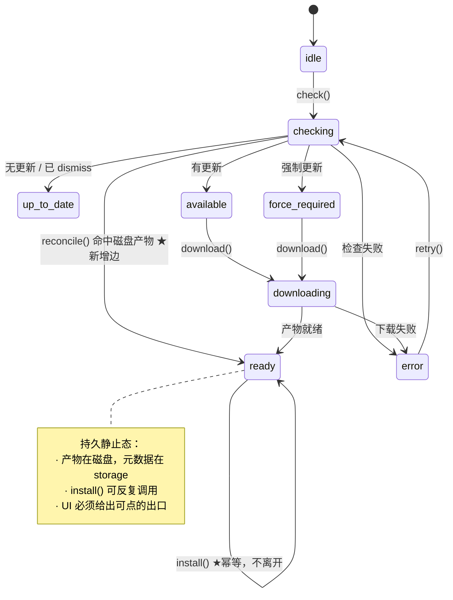

# Design — ready-state-durability

## 状态机：改的不是拓扑，是 `ready` 的语义

8 个状态一个不增不减，跃迁边也不变。变的是 `ready` 这个节点的性质：



唯一新增的边是 `checking → ready`：check 发现有更新、且 `reconcile()` 在磁盘上找到了匹配
且完整的产物 —— 直接跳过整个下载阶段。这条边就是「退出应用回来又得全部重下」的解。

`ready → ready` 的自环是本提案的核心：**install 不再是一次性消费**。

---

## D1：为什么 `ready` 必须是静止态，而不是「正在等系统」

现在的代码把 ready 读成「已移交给系统，正在等结果」。这个读法有两个致命前提，
在 Android sideload 下都不成立：

1. **前提：移交一定成功。** 实际上后台启动 Activity 会被静默丢弃 —— 没有异常、没有回调。
2. **前提：结果会回来。** 实际上 `ACTION_VIEW` 是 fire-and-forget，用户在系统框点「取消」
   或直接返回，应用侧收不到任何东西。

一个「等待外部结果」的状态，在外部既不保证接收、也不保证回复的情况下，就是死锁。

正确的读法：**ready 描述的是本地事实 —— 「我手上有一个可安装的产物」**。这个事实与系统
弹窗弹没弹、用户点没点无关，它只在两种情况下失效：产物被安装成功（下次 check 时
`compare()` 判定无更新），或产物损坏/过期（`reconcile()` 清理掉）。

推论：ready 可以停留任意久，可以跨进程重启存活，可以被反复触发安装。三条不变量由此而来。

---

## D2：句柄何时才真正销毁

现在：`install()` 一进来就 `pendingHandle = null`。

改为句柄只在这三个时刻销毁：

| 时刻 | 理由 |
|---|---|
| `reconcile()` 返回 null | 平台层判定磁盘产物不可用（版本不匹配 / 损坏 / 已被清理） |
| `retry()` | 用户显式要求从头来过，语义上就该丢弃 |
| 新的 `download()` 开始 | 新句柄覆盖旧句柄，自然替换 |

**不在 `install()` 里销毁**。原注释写着「payload 必须 self-contained（engine install 前会清
pendingHandle）」—— 这个约束反过来了：正因为 payload 是 self-contained 的（RN 存的是 APK
路径，Tauri 存的是 Update 对象），它才**可以**被反复使用。self-contained 是保留它的理由，
不是丢弃它的理由。

**连带修正 `acknowledgeError()`**：它现在按 `release` 二选一恢复到 `available` /
`force-required` / `idle`。install 失败后走这条路会掉进一个新的坑 —— 产物还在磁盘上，status
却是 `available`，而 `install()` 要求 `status === "ready"`，于是唯一出路又变成重下。恢复目标
必须由**产物是否还在**决定：持有句柄 → `ready`，否则才按 release 判。这是 D1 的直接推论：
状态描述的是本地事实，那么从错误中恢复也应该回到本地事实所对应的那个状态。

---

## D3：`reconcile` 而不是 `restore`，因为它有双重职责

新端口的签名：

```ts
/**
 * 让本地残留产物与当前候选 release 对齐。可选 —— 不实现即等价于「从不复用产物」。
 *
 * @param release 当前候选；`null` 表示「没有任何候选」（已是最新 / 用户已 dismiss）
 * @returns 与 release 匹配且完整的可安装句柄；无可用产物返回 null
 *
 * 实现 SHALL 在返回 null 的同时清理掉不再有用的残留（版本不符 / 损坏 / 候选为 null），
 * 否则磁盘上会永久躺着一个装过了的 APK。
 */
reconcile?(release: ReleaseInfo | null): Promise<DownloadHandle | null>;
```

叫 `reconcile` 而不是 `restore`，是因为它要做的不只是「恢复」：

- `release` 非空且磁盘产物匹配 → **恢复**，返回句柄，engine 直接进 ready
- `release` 非空但磁盘产物是旧版本 → **清理**旧的，返回 null，engine 走正常下载
- `release` 为 null（已是最新，说明上次那个 APK 已经装上了）→ **清理**，返回 null

三件事是同一件事：让磁盘状态与候选状态对齐。一个方法、一个语义，比 `restore` + `cleanup`
两个方法更简洁，也不会出现「只调了其中一个」的半吊子状态。

**为什么不把持久化放进 engine？** 因为 `DownloadHandle.payload` 按契约就是平台不透明的
（`payload?: unknown`）。engine 无法序列化它，更无法校验磁盘上那个文件还在不在、完不完整。
这件事只有平台层做得了 —— 这正是端口存在的意义。

**为什么是可选（`?`）？** Tauri 侧没有可恢复的东西：`plugin-updater` 的下载产物在插件内部，
不暴露路径。不实现 = 保持现状，零负担。这也让端口扩展不会破坏任何现有 adapter。

---

## D4：自动 install 的时机归 registry，不归 engine

engine 是平台无关的，它不认识 `AppState`、不知道什么叫「前台」。**Background Activity
Launch 是 Android 的约束，就应该在 registry-rn 里解决。**

registry-rn 的规则（新 hook `useAutoInstall`）：

```
每当 app 从非 active 变为 active，且 status === "ready"，
且当前 release 尚未自动尝试过 → 触发一次 install()
```

- **为什么门禁在「前台」**：BAL 的例外条件之一就是「app has a visible window」。前台时发
  intent 必定合法，后台时发必定被丢。与其发出去被静默吞掉，不如根本不发、留在 ready 等
  用户回来。
- **为什么「每个 release 只自动一次」**：拉起系统安装框会让 app 短暂离开前台；用户在框里
  点「取消」再回到 app，AppState 又变 active —— 不设记号就会无限弹框。记号**不必持久化**：
  进程重启后再自动尝试一次，对用户是友好的。
- **闸门必须是进程级而非组件级**：更新 UI 常常同时挂着好几个消费者（prompt / force /
  progress / settings），各持一份 ref 就会各自派发一次安装。此前靠 engine「install 用掉即清
  句柄」意外地去了重，句柄改为可反复使用后那层保护就没了 —— 见 4b。
- 自动尝试用掉之后，ready 态的主按钮就是用户的手动出口 —— 这正是 D5 要求它必须可点的原因。

registry-web-tauri 侧不需要前台门禁（桌面无 BAL 限制），但**同样需要单点触发**：那边把
「进 ready 即 install」整个上移到 `UpdateProvider`（天然单例），三个组件里一个 effect 都不留。
两端都受益于 install 幂等：Windows 上 UAC 被取消后，用户可以再点一次。

---

## D5：No Dead End 规则

一条写进两个 registry 的硬规则：

> **更新流程中的任何 UI 状态，都必须至少有一个用户可操作的出口。**

落到三个具体约束：

| # | 约束 | 现状违反 |
|---|---|---|
| 1 | `ready` 态主按钮**必须可点**，点击 = 重试 install | `disabled={busy}`，busy 含 isReady |
| 2 | 进度弹窗**必须可关**；关闭只隐藏 UI，不取消下载、不改 status | web 双 preventDefault 且无 footer；RN 受控 open 无 onOpenChange |
| 3 | 设置区的状态判据**必须覆盖全部 8 态** | `hasUpdate = available \|\| force-required` 的二元判据把 ready 落进 else，显示「已是最新」 |

**强制更新弹窗是唯一的例外** —— 它按设计就不可关闭。但它同样受 #1 约束：ready 态下
主按钮必须可点，否则强更用户会被彻底锁死（比普通用户更糟，因为他连 × 都没有）。

约束 #2 有个反直觉的推论：**「关闭进度弹窗」不等于「取消更新」**。下载继续，status 不动，
用户回到设置区仍能看到进度与安装入口。这与 Play 的 flexible 模型一致 —— 下载是后台工作，
不该霸占前台。

---

## D6：ready 态的文案要说人话

`ready` 现在的提示是「系统弹窗确认中…」/「Waiting for the system installer…」—— 它在陈述一件
应用侧根本无法确认的事，而且在故障场景下就是错的（系统弹窗压根没弹）。

改成陈述本地事实 + 给出动作：

| locale | 旧 | 新 |
|---|---|---|
| zh-Hans | 系统弹窗确认中… | 更新已就绪，点击安装 |
| en | Waiting for the system installer… | Update ready — tap to install |

`update-texts.ts` 顺带做一次清账 —— 没有生产者的键要删掉，而不是留在必填接口里逼着每个
下游 override 提供一个永不渲染的字符串（`systemConfirmHint` 被 `readyHint` 取代、
`unknownSourceHint` 随权限门禁一起消失、`restartingButton` 的两个调用点都改用了
`installButton`）。剩下的三句加一句新的：

| 文案 | 何时显示 |
|---|---|
| `readyHint` | 缺省 —— 产物就绪，等用户点 |
| `foregroundRequiredHint`（新） | 门禁 reason = `background`：intent 没派发，回到应用即可继续 |
| `canceledRetry` | 自动尝试已用掉、仍停在 ready（大概率是他在系统框点了取消） |

判据抽成纯函数 `readyHintKind(blockedReason, autoAttemptSpent)`（可测），文案映射在
`readyHintText`——两者分开，好让判据与措辞各自独立演进。

**没有 `permission` 分支**，`unknownSourceHint` 与 `openPermissionSettings` 一并删除。
`expo-intent-launcher` 不暴露 `canRequestPackageInstalls`，任何内建探测都是猜；猜错一次
（把"能装"判成"没权限"）就白白挡掉一次更新。未授权时照常派发，Android 自己会把用户领到
授权页 —— 授权后返回，ready 还在，点「立即安装」即可。**这是通路，不是死路。**
留一个产生不出来的 reason 只会长出一条永远走不到的 UI 分支，并让人以为已经有引导了。

---

## D7：续传做不到，别假装做得到

原计划是把 `expo-file-system` 的续传能力打开——现有代码每次开下前主动删残留、从不存
`savable()`、从不 `resumeAsync()`，看上去只是"没接线"。

**接完线才发现那条路根本不通。** 看 expo 的实现：

```ts
async pauseAsync(): Promise<DownloadPauseState> {
  const pauseResult = await ExponentFileSystem.downloadResumablePauseAsync(this.uuid);
  if (pauseResult) {
    this.resumeData = pauseResult.resumeData;   // ← 只有这一处赋值
    return this.savable();
  }
}
savable(): DownloadPauseState {
  return { url, fileUri, options, resumeData: this.resumeData };  // 只是读回来
}
```

`resumeData` **只有 `pauseAsync()` 会产出**。而我们的失败场景是"进程被杀"——没有任何钩子
能在那之前调用它。于是"下载开始前存 savable、下次用它 resume"存下来的 `resumeData` 恒为
`undefined`，`resumeAsync(undefined)` 不带 `Range` 头，原生层反而会 truncate 目标文件。

净效果：全量重下 + 一个多余的残留文件 + 一份假装有用的存档 + 一组只证明了 mock 自己行为的
绿色测试。**比不做还糟**，因为它让人以为字节被保住了。

真要做只有一条路：`AppState` 切后台时 `pauseAsync()` 立刻 `resumeAsync()`，把真实的
`resumeData` 刷出来。但那会打断后台下载，而"熄屏也要能下完"正是这套流程的诉求。得不偿失。

**所以：下载中断就是重下，如实说明。** 用户抱怨的两个场景里，"下载完成后退出"由 `reconcile`
真正解决了；"下载一半退出"没有解决，也不该在 UI 或文档里暗示解决了。

> 教训不在于 API 读错了，而在于**测试用 mock 喂出了真实实现给不出的值**。
> mock 的 `savable()` 返回 `resumeData: "mock-resume-token"`，于是续传用例全绿。
> 现在那个 mock 里保留 `resumeCalls` 作为反向护栏：它非空就说明有人重新引入了这条走不通的路。

## 风险

| 风险 | 缓解 |
|---|---|
| `reconcile` 误判残留产物完整 → 装到损坏的 APK | 复用现有三层校验（尺寸 + ZIP magic + 版本匹配）；最终由 Android 安装器验签兜底 |
| 下载中断后必须重下（不做续传，见 D7） | 已知取舍，如实反映在 spec 与知识库里；`reconcile` 覆盖的是「下载完成后退出」那一半 |
| ready 跨进程恢复后，服务端已下线该 release | 产物本身仍然可装（字节已在本地且校验过）；下线场景由 `minVersion` 而非产物可用性表达 |
| install 幂等后，用户连点造成多个系统安装框 | Android 的 PackageInstaller 自身对同一 APK 会复用/覆盖会话；且主按钮在 intent 派发后有短暂 pending 反馈 |
